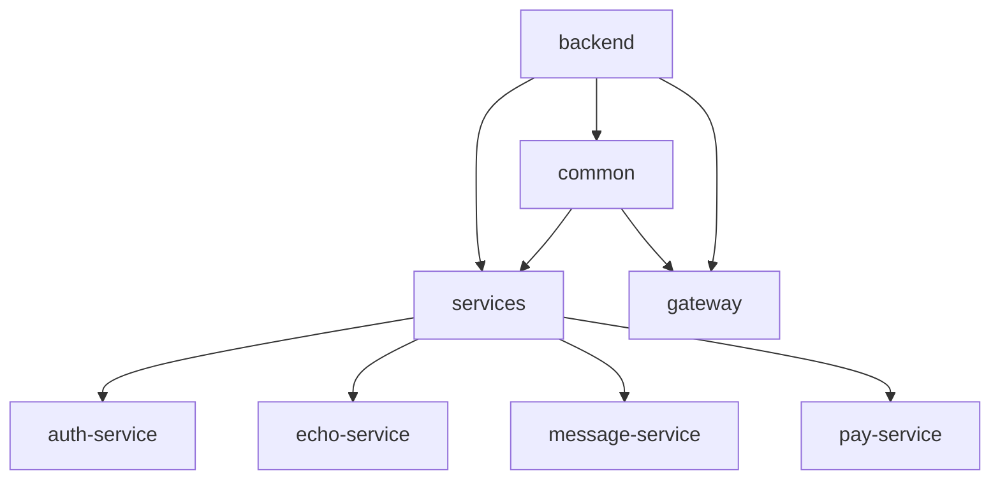

# 项目文档


## 📖 项目简介

### 1. 项目背景

在《鸣潮》这款游戏中，**声骸**是指一种具有特殊能力和属性的虚拟生物

一个声骸具有的属性如下：

* 1 个主词条
* 1 个 `Cost` 值
* 5 个副词条


系统会根据其属性值与角色的匹配程度（相对应的词条权重）来为其评分

一个角色最多可穿戴 5 个声骸，且声骸的总 `Cost` 值不得大于 12

### 2. 项目目的

用于帮助玩家为自己喜欢的角色搭配出最合适的一套声骸组合

帮助玩家作出决策，优化角色、提高战斗能力

### 3. 项目说明

1. 项目只关心声骸的副词条属性，并且以此为依据作出评分

2. 项目不关心声骸的技能，主词条属性，套装效果等等

3. 项目默认属性：

   * 角色：
     * 五星角色：90 级，0 共鸣链，满技能
     * 四星角色：90 级，6 共鸣链，满技能
   * 武器：对应角色专武 90 级（武器可以去角色基础属性模块设置），谐振 1 阶

   * 声骸：5 星的满调谐声骸

4. 目前有绝大部分的角色默认权重都由搜寻攻略得出，等我养到了再进行人工配置


## 🚀 快速开始

### ⚙️ 环境要求

|   环境     |   版本    | 服务端口 |     备注     |
| :-------: | :------: | :------: | :----------: |
|    JDK    |    17    |    -     |   严格匹配   |
|  Node.js  | 20.16.0  |    -     |  LTS版本     |
|   MySQL   |   5.7    |   3306   |  最低要求    |
|   Redis   |  5.0+    |   6379   |  兼容版本    |
| RabbitMQ  |   3.8    |   5672   | 管理端口 15672 |
|   Nacos   |  2.4.3   |   8848   |  服务注册中心  |
| Sentinel  |  1.8.8   |   8080   |  流量控制台   |
|   Seata   |  2.1.0   |   8091   | 管理端口 7091 |
|  cpolar   |    -     |   4000   | 内网穿透工具  |

❗ **版本警告**：

本项目使用 **精确版本锁定** 策略，若使用更高版本组件可能导致兼容性问题

（测试通过版本见上文，建议使用相同版本避免环境问题）

### 🔧 启动步骤

#### 1. 中间件服务启动

* **Redis**：（需本地安装）

  ```sh
  redis-server 
  ```

* **RabbitMQ**：（需本地安装）

  ```sh
  rabbitmq-server
  ```
  
  访问管理台：http://localhost:15672

* **Nacos**：（需本地安装）

  ```sh
  cd nacos/bin
  startup.cmd -m standalone
  ```
  
  访问控制台：http://localhost:8848/nacos

* **Sentinel**：（需本地安装）

  ```sh
  java -jar sentinel-dashboard-1.8.8.jar
  ```
  
  访问控制台：http://localhost:8080
  
  账户：sentinel
  
  密码：sentinel

* **Seata**：（需本地安装）

  ```sh
  cd seata/bin
  seata-server.bat
  ```
  
  访问控制台：http://localhost:7091
  
  账户：seata
  
  密码：seata

#### 2. 数据库初始化

```sh
# 创建所有服务数据库（需逐个执行）
mysql -u root -p -e "CREATE DATABASE auth_service_db CHARACTER SET utf8mb4;"
mysql -u root -p -e "CREATE DATABASE echo_service_db CHARACTER SET utf8mb4;"
mysql -u root -p -e "CREATE DATABASE message_service_db CHARACTER SET utf8mb4;"
mysql -u root -p -e "CREATE DATABASE pay_service_db CHARACTER SET utf8mb4;"

# 导入各服务表结构（注意替换实际路径）
mysql -u root -p auth_service_db < ./sql/auth_service_db.sql
mysql -u root -p echo_service_db < ./sql/echo_service_db.sql
mysql -u root -p message_service_db < ./sql/message_service_db.sql
mysql -u root -p pay_service_db < ./sql/pay_service_db.sql
```

**可视化操作指南**

1. 新建连接 -> 输入 root/123456

2. 逐个创建以下数据库：

   |     数据库名称     |      字符集/排序规则       |
   | :----------------: | :------------------------: |
   |  auth_service_db   | utf8mb4/utf8mb4_general_ci |
   |  echo_service_db   | utf8mb4/utf8mb4_general_ci |
   | message_service_db | utf8mb4/utf8mb4_general_ci |
   |   pay_service_db   | utf8mb4/utf8mb4_general_ci |

3. 逐个双击数据库 -> 右键运行对应SQL文件

#### 3. 内网穿透配置
```sh
# 启动 cpolar（需本地安装）
cd D:\software\cpolar # （注意替换实际路径）
cpolar.exe http 4000 # 生成公网地址后，替换 pay-service 服务 application-alipay.yml 中的 notifyUrl
```

#### 4. 修改配置文件

⚠️ **支付宝沙箱必改项**

修改 `pay-service` 的 `application-alipay.yml`：

```yml
alipay:
  easy:
    appId: [替换为您的沙箱APPID]
    merchantPrivateKey: [替换为您的应用私钥]
    alipayPublicKey: [替换为支付宝公钥]
    notifyUrl: [替换为您的cpolar穿透地址]/api/pay/notify
```
⚠️ **邮箱必改项**

修改 `message-service` 的 `application-email.yml`：

```yml
spring:
  mail:
    host: smtp.163.com
    username: [替换为您的邮箱账号]
    password: [替换为您的邮箱密码]
    port: 465
    properties:
      from: [替换为您的邮箱账号]
      mail:
        smtp:
          socketFactory:
            class: javax.net.ssl.SSLSocketFactory
```

#### 5. 后端服务启动
```sh
# 网关服务
cd gateway
mvn spring-boot:run # 端口 4000

# 各微服务（需分别启动）
cd services/auth-service
mvn spring-boot:run # 端口 4050

cd services/echo-service
mvn spring-boot:run # 端口 4060

cd services/message-service
mvn spring-boot:run # 端口 4070

cd services/pay-service
mvn spring-boot:run # 端口 4080
```

#### 6. 前端启动
```bash
cd frontend
npm install
npm run dev
```

访问地址：http://localhost:5173 即可

⚠️ 注意事项

1. MySQL 账号默认为 `root/123456`，若不同需修改各服务 `application-datasource.yml`
2. Nacos 需保持运行状态，否则服务注册将失败
3. 支付宝沙箱配置需自行申请应用 ID 和密钥，并替换 `application-alipay.yml` 中的敏感信息
4. 本地开发时建议关闭防火墙，确保中间件端口可访问


## 📌 使用说明

在线访问地址：http://8.138.214.176:5173

本地访问地址：http://localhost:5173

### ➤ 账号体系说明

#### 1. 注册账号

点击前往**注册账号**


**填写用户名，密码等相关信息**后，完成**我是人类**验证，再点击**获取验证码**

大概半分钟后，系统就会发送验证码至你的邮箱

验证码三分钟之内有效，一分钟内不得重复获取验证码


#### 2. 登录界面

填写**用户名 / 邮箱 + 密码**进行登录

可以勾选**记住我**功能（用户在登录后的一段时间内，只要不退出登录，则不需要验证，就可以直接登录）


#### 3. 忘记密码

点击前往**忘记密码**模块


首先需要**进行电子邮件的验证**，依然是通过验证码的形式


之后**填写新密码**即可


#### 4. 退出登录

鼠标悬浮在右上角头像处

触发下拉菜单，**点击退出登录**即可退出系统


#### 5. 注销用户

同上，**点击注销用户**将会注销用户

* **注意：**这将会清空该用户的全部信息，无法撤销！


#### 6. 修改用户信息

**点击修改用户信息**，会出现表单模块


用户可以自由选择需要修改什么信息，不填写的默认不进行修改

只有当需要修改用户邮箱时，需要填写的新邮箱的验证码

提交后修改生效，系统会自动退出登录，用户需要重新登陆


### ➤ 各模块特殊说明

#### 1. 筛选条件


筛选规则：行与行之间为逻辑与，行内元素之间为逻辑或

开启筛选后，角色的平均分计算规则也会改变

#### 2. 声骸列表

在此展示角色的声骸列表，一个角色最多配佩戴 5 个声骸，且 Cost 总值最多为 12

鼠标放在声骸的得分单元格时，会出现**修改声骸**和**移除声骸**按钮


每个参数的含义如下：


#### 3. 临时列表

鼠标放在声骸的得分单元格时，会出现**修改声骸 / 添加声骸**和**移除声骸**按钮


最左侧为声骸数据，右侧为该声骸搭配在不同角色身上的评分情况

临时声骸列表中的数据，不计入后面的数据统计模块，相当于一个暂存区，玩家可以在这里对声骸进行横向比对

选择好要给哪位角色后，可以直接将该声骸一键添加至正式的角色声骸列表中，添加后会自动将该声骸从临时声骸列表移除

特别的，开启角色筛选后，横向排序规则将会改为按角色名称进行排序

#### 4. 角色声骸

##### 4.1 声骸属性


右侧表格的数据为：根据声骸列表中，该名角色的所有声骸的全部副词条属性的累加

##### 4.2 副词条平均加点次数


> 角色的副词条平均加点次数的计算公式：
> $$
> \overline{cnt} = \frac{sum}{\overline{x}}
> $$
>
> * $\overline{cnt}$ ：角色的副词条平均加点次数
> * $sum$ ：角色的该项副词条的取值之和
> * $\overline{x}$ ：该项副词条调谐一次的期望取值

##### 4.3 副词条标准化偏差


> 副词条标准化偏差的计算公式：
> $$
> D = \frac{sum}{n\cdot\overline{x}}\times100\%
> $$
>
> * $D$ ：副词条标准化偏差
> * $sum$ ：该项副词条的取值之和
>
> * $n$ ：该项副词条的出现次数
>
> * $\overline{x}$ ：该项副词条调谐一次的期望取值

**含义：**

* 如果这个值比较低，说明你每次调谐的时候，这个副词条的取值普遍较低

* 如果这个值比较高，说明你每次调谐的时候，这个副词条的取值普遍较高

#### 5. 声骸汇总

##### 5.1 声骸评级


声骸评级的含义如下：

| 声骸评级 |         含义          |
| :------: | :-------------------: |
|    F     |  0 <= 声骸评分 < 30   |
|    D     |  30 <= 声骸评分 < 40  |
|    C     |  40 <= 声骸评分 < 50  |
|    B     |  50 <= 声骸评分 < 60  |
|    A     |  60 <= 声骸评分 < 70  |
|    S     |  70 <= 声骸评分 < 80  |
|    SS    |  80 <= 声骸评分 < 90  |
|   SSS    | 90 <= 声骸评分 <= 100 |

##### 5.2 声骸词条标准化偏差


同副词条标准化偏差

#### 6. 词条权重

##### 6.1 词条权重峰度


> 角色的词条权重峰度（这里指的是过剩峰度）的计算公式：
> $$
> μ = \frac{1}{n} \sum_{i=1}^{n} x_i
> $$
>
> $$
> σ=\sqrt{\frac{1}{n} \sum_{i=1}^{n} (x_i - \mu)^2}
> $$
>
> $$
> μ_4=\frac{1}{n} \sum_{i=1}^{n} (x_i - \mu)^4
> $$
>
> $$
> γ_2= \frac{\mu_4}{\sigma^4} - 3
> $$
>
> 
>
> * $γ_2$ ：角色的词条权重峰度
> * $n$ ：副词条的种数，目前为 13
> * $x_i$ ：角色的第 $i$ 项副词条的权重
> * $σ$ ：角色的词条权重标准差
> * $μ_4$ ：角色的词条权重四阶中心矩

**含义：**

* 如果这个值比较低，说明这个角色的词条权重分布较为平滑，更易于养成

* 如果这个值比较高，说明这个角色的词条权重分布较为尖锐，更难以养成

##### 6.2 副词条权重占比


默认词条权重的规则：

> $w(i)$：词条 $i$ 的权重

1. $w(i)$ 的取值范围为 $[0, 100]$
2. 确定对角色毫无贡献的副词条的权重为 $0$，对角色最有贡献的副词条的权重为 $100$
3. 其余的副词条权重，以最大值 $100$ 为基准计算相对比值
4. 一般情况下，对于主 C 角色：
   1. $w(暴击率) = w(暴击伤害) = 100$
   2. $w(百分比攻击) = 71$
5. 对于全部角色：
   1. $w(百分比攻击) > w(伤害加成)$
   2. $w(固定属性) = c * w(百分比属性)$

#### 7. 角色基础属性

**点击武器图像**后，设置武器模块会弹出


点击即可设定该名角色的武器（不点击默认不进行更改）

关闭抽屉页面后设定生效


#### 8. VIP支付系统（沙箱环境说明）

为保障用户资金安全及遵守支付平台规范，特此说明：

1. **开发背景**：本系统为开发者学习支付宝API对接所构建的技术demo，仅用于测试环境验证支付流程
2. **沙箱环境**：因个体开发者资质限制，当前采用支付宝官方提供的沙箱测试环境，所有资金流转均为模拟数据，不会产生真实交易
3. **资金安全**：测试环境中使用的"支付账户"为虚拟账号，系统不会收集/使用任何真实支付信息
4. **功能限制**：本环境不支持真实货币结算，支付成功状态仅用于验证技术流程，请勿将其视为真实支付服务

*温馨提示：如需体验完整支付流程，可使用支付宝沙箱版APP（[沙箱环境 - 支付宝文档中心](https://opendocs.alipay.com/common/02kkv7?pathHash=9a45a6d6)）配合测试。感谢您的理解与支持！*


使用支付宝沙箱版APP，扫这个二维码去付款，点击《我已完成支付》


未支付响应：


支付成功响应：


即可解锁VIP专属特权：

1. 金色昵称
2. 金色头像框


#### 9. 导入声骸数据

还是右上角头像处，**点击导入声骸数据**，会出现表单模块


相关参数的获取可以参考这个教程：[ProxyPin使用教程](http://8.138.214.176:5173/ProxyPin使用教程.html)

输入相关参数后，点击提交


等待数据抓取，期间不要刷新页面

抓取成功后数据自动导入到声骸列表


⚠️ 特殊说明：**只会抓取5星满级满调谐的声骸**


## 🔍 原理讲解

### 1. 副词条权重的计算

#### 1.1 鸣潮总伤害计算公式

鸣潮总伤害计算公式：
$$
总伤害 = ((角色基础数值 + 武器基础数值) \times (1 + 百分比攻击) + 固定攻击) \times 暴击伤害 \times (1 + 属性伤害加成 + 技能伤害加成) \times 技能倍率 \times (1 + 倍率提升) \times (1 + 伤害加深) \times \frac{100 + 角色等级}{199 + 角色等级 + 怪物等级} \times (1 - 属性抗性) \times (1 - 属性伤害减免)
$$
如果我们只关注与声骸副词条有关的部分，那么简化后的计算公式为：
$$
总伤害 = ((角色基础数值 + 武器基础数值) \times 百分比攻击 + 固定攻击) \times 暴击伤害 \times 技能伤害加成
$$

#### 1.2 百分比攻击，暴击伤害，技能伤害加成的权重计算

根据上式可知，百分比攻击，暴击伤害，技能伤害加成都是正相关

> $x(i)$ ：副词条 $i$ 调谐一次的期望取值
>
> $w(i)$ ：副词条 $i$ 的权重

已知 $x(暴击伤害) = 16.8，x(百分比攻击) = x(技能伤害加成) = 9.0$

有 $\frac{w(暴击伤害)}{w(百分比攻击)} = \frac{x(暴击伤害)}{x(百分比攻击)}$

定义 $w(暴击伤害) = 100$，取暴击期望为 $50\%$，根据上式四舍五入计算出 $w(百分比攻击) = 71$

虽然 $x(百分比攻击) = x(技能伤害加成)$

但是百分比攻击可以作用于所有出伤，因此才会有 $w(百分比攻击) = w(普攻伤害加成) + w(重击伤害加成) + w(共鸣技能伤害加成) + w(共鸣解放伤害加成)$ 这一结论

#### 1.3 固定属性的权重计算

以固定属性做一个标准化

有 $\frac{w(固定属性)}{w(百分比属性)} = \frac{x(固定属性)}{x(百分比属性) \times (角色基础数值 + 武器基础数值)}$

### 2. 声骸评分算法

#### 2.1 计算理论最大分数

1. 选择权重最大的 5 项副词条

2. 将它们的取值都取理论最大值

3. 单项副词条的得分点数计算公式：

   > $$
   > s = \frac{x}{\overline{x}} \times \frac{w}{sum(w)}
   > $$
   >
   > * $s$ ：单项副词条的得分点数
   > * $x$ ：该项副词条的实际取值
   > * $\overline{x}$ ：该项副词条调谐一次的期望取值
   > * $w$ ：该项副词条的权重
   > * $sum(w)$ ：该角色权重最大的 5 项副词条权重之和

4. 累加每项副词条的得分点数得到理论最大分数

#### 2.2 计算最终声骸评分

1. 根据上面的计算规则，将取值替换为实际取值，计算得出实际分数

2. 最终声骸评分的计算公式：

   > $$
   > 最终声骸评分 = \frac{实际分数}{理论最大分数} \times 100
   > $$

所以，最终声骸评分的取值范围为 $[0, 100]$

#### 2.3 计算副词条对评分的贡献百分比

副词条对评分的贡献百分比的计算公式：

   > $$
   > 副词条对评分的贡献百分比 = \frac{该项副词条的得分点数}{总的得分点数} \times 100\%
   > $$

### 3. 理论基础支撑

鸣潮总伤害计算公式：[【鸣潮】伤害论 伤害乘区与稀释详解 怎么样才能最大化输出？《鸣潮》底层机制系列01](https://www.bilibili.com/video/BV1VZ42147px/?spm_id_from=333.999.0.0&vd_source=50647b976189fed7c41a37586097b659)


角色默认词条权重：

* [【鸣潮】最新全角色声骸养成作业 武器&共鸣链收益计算 含声骸词条思路规则_哔哩哔哩bilibili](https://www.bilibili.com/video/BV1Tf421X7fm/?spm_id_from=333.999.0.0)

* [【鸣潮】长离强度解析+养成作业 声骸词条/共鸣链/武器分析](https://www.bilibili.com/video/BV1nM4m1y718/?spm_id_from=333.999.0.0)

* [【鸣潮】守岸人解析 百搭暴力人权拐！强度解析＋养成作业：声骸词条 共鸣链 武器分析](https://www.bilibili.com/video/BV1RqxBepEs7/?spm_id_from=333.999.0.0&vd_source=50647b976189fed7c41a37586097b659)

* [【鸣潮】椿解析 首位常态双形态！养成作业+进阶技巧：声骸词条 共鸣链 武器分析_哔哩哔哩bilibili](https://www.bilibili.com/video/BV1RmU3YnEMF/?spm_id_from=333.999.0.0&vd_source=50647b976189fed7c41a37586097b659)
* ......

在此感谢这三位 B 站 UP 主：

* [青空の霞光 bilibili](https://space.bilibili.com/37737161?spm_id_from=333.337.0.0)

* [叫我棉被-哔哩哔哩_bilibili](https://space.bilibili.com/6014992?spm_id_from=333.337.0.0)

* [金铃子攻略组-哔哩哔哩_bilibili](https://search.bilibili.com/all?keyword=金铃子攻略组&from_source=webtop_search&spm_id_from=333.1007&search_source=2)


## 🛠️ 技术栈

### 后端

- **框架**：
  - **核心框架**：Spring Boot、Spring MVC、MyBatis
  - **微服务框架**：Spring Cloud Gateway、Spring Cloud OpenFeign、Nacos
- **数据库**：MySQL、Redis
- **第三方库**：Lombok、Fastjson、Apache Commons Math3、Sentinel
- **安全**：JWT、BCryptPasswordEncoder
- **工具与功能：**
  - **服务治理**：Nacos 服务注册与发现
  - **全局功能**：网关请求日志、拦截器
  - **异常处理**：全局异常拦截、Sentinel 限流熔断
  - **服务通信**：Feign 客户端、负载均衡
  - **事务管理**：Spring 事务、Seata 分布式事务

### 前端

- **框架**：Vue 3
- **状态管理**：Pinia
- **UI 组件库**：Element Plus、Element Plus Icons
- **路由**：Vue Router
- **HTTP 请求库**：Axios
- **构建工具**：Vite


## 📊 代码量统计

数据截止至 **v1.8.0**

（单位：行，不包含文档代码）

|    项目名    | 后端 | 前端 | 总和  |
| :----------: | :--: | :--: | :---: |
|   网关服务   | 328  |  -   |  328  |
|   认证服务   | 693  |  -   |  693  |
|   声骸服务   | 1876 |  -   | 1876  |
|   消息服务   | 587  |  -   |  587  |
|   支付服务   | 524  |  -   |  524  |
| （其他代码） | 751  | 5904 | 6655  |
|   **总和**   | 4759 | 5904 | 10663 |


## 📂 项目结构

### 后端

本地服务拓扑图：


父子模块结构关系图：




```
backend
├── common
│   ├── src
│   │   └── main
│   │       ├── java
│   │       │   └── com
│   │       │       └── common
│   │       │           ├── client
│   │       │           │   ├── fallback
│   │       │           │   │   └── AuthClientFallback.java
│   │       │           │   └── feign
│   │       │           │       └── AuthClient.java
│   │       │           ├── config
│   │       │           │   ├── FeignConfig.java
│   │       │           │   ├── FilterConfig.java
│   │       │           │   └── RedisConfig.java
│   │       │           ├── constant
│   │       │           │   └── Constant.java
│   │       │           ├── context
│   │       │           │   └── UserContext.java
│   │       │           ├── entity
│   │       │           │   ├── AuthenticationDTO.java
│   │       │           │   ├── RestBean.java
│   │       │           │   └── User.java
│   │       │           ├── filter
│   │       │           │   └── UserContextFilter.java
│   │       │           ├── mapper
│   │       │           │   └── DataGovernanceMapper.java
│   │       │           ├── service
│   │       │           │   ├── api
│   │       │           │   │   └── DataGovernanceService.java
│   │       │           │   └── impl
│   │       │           │       └── DataGovernanceImpl.java
│   │       │           └── util
│   │       │               └── KeyGeneratorUtil.java
│   │       └── resources
│   └── pom.xml
├── gateway
│   ├── src
│   │   └── main
│   │       ├── java
│   │       │   └── gateway
│   │       │       ├── exception
│   │       │       │   └── MyBlockRequestHandler.java
│   │       │       ├── filter
│   │       │       │   ├── AuthGlobalFilter.java
│   │       │       │   └── ResponseTimeLoggingFilter.java
│   │       │       └── GatewayMainApplication.java
│   │       └── resources
│   │           ├── application-route.yml
│   │           └── application.yml
│   └── pom.xml
├── services
│   ├── auth-service
│   │   ├── src
│   │   │   ├── main
│   │   │   │   ├── java
│   │   │   │   │   └── com
│   │   │   │   │       └── auth
│   │   │   │   │           ├── client
│   │   │   │   │           │   ├── fallback
│   │   │   │   │           │   │   └── MessageClientFallback.java
│   │   │   │   │           │   └── feign
│   │   │   │   │           │       ├── EchoClient.java
│   │   │   │   │           │       ├── MessageClient.java
│   │   │   │   │           │       └── PayClient.java
│   │   │   │   │           ├── controller
│   │   │   │   │           │   └── AuthorizeController.java
│   │   │   │   │           ├── mapper
│   │   │   │   │           │   └── UserMapper.java
│   │   │   │   │           ├── service
│   │   │   │   │           │   ├── api
│   │   │   │   │           │   │   └── AuthorizeService.java
│   │   │   │   │           │   └── impl
│   │   │   │   │           │       ├── AuthorizeServiceImpl.java
│   │   │   │   │           │       └── JwtService.java
│   │   │   │   │           └── AuthMainApplication.java
│   │   │   │   └── resources
│   │   │   │       ├── application-datasource.yml
│   │   │   │       └── application.yml
│   │   │   └── test
│   │   │       └── java
│   │   │           └── com
│   │   │               └── auth
│   │   │                   └── AuthTest.java
│   │   └── pom.xml
│   ├── echo-service
│   │   ├── src
│   │   │   ├── main
│   │   │   │   ├── java
│   │   │   │   │   └── com
│   │   │   │   │       └── echo
│   │   │   │   │           ├── controller
│   │   │   │   │           │   ├── DataGovernanceController.java
│   │   │   │   │           │   └── EchoScoringSystemController.java
│   │   │   │   │           ├── dto
│   │   │   │   │           │   ├── EchoPair.java
│   │   │   │   │           │   └── RoleDTO.java
│   │   │   │   │           ├── entity
│   │   │   │   │           │   ├── Character.java
│   │   │   │   │           │   ├── CharacterConfigDO.java
│   │   │   │   │           │   ├── Echo.java
│   │   │   │   │           │   ├── EchoDO.java
│   │   │   │   │           │   └── Weapon.java
│   │   │   │   │           ├── mapper
│   │   │   │   │           │   └── EchoMapper.java
│   │   │   │   │           ├── service
│   │   │   │   │           │   ├── api
│   │   │   │   │           │   │   └── EchoScoringSystemService.java
│   │   │   │   │           │   └── impl
│   │   │   │   │           │       └── EchoScoringSystemServiceImpl.java
│   │   │   │   │           ├── util
│   │   │   │   │           │   ├── EchoConvert.java
│   │   │   │   │           │   └── EchoUtil.java
│   │   │   │   │           └── EchoMainApplication.java
│   │   │   │   └── resources
│   │   │   │       ├── application-datasource.yml
│   │   │   │       └── application.yml
│   │   │   └── test
│   │   │       └── java
│   │   │           └── com
│   │   │               └── echo
│   │   │                   └── EchoTest.java
│   │   └── pom.xml
│   ├── message-service
│   │   ├── src
│   │   │   ├── main
│   │   │   │   ├── java
│   │   │   │   │   └── com
│   │   │   │   │       └── message
│   │   │   │   │           ├── config
│   │   │   │   │           │   ├── ErrorMessageConfig.java
│   │   │   │   │           │   └── RabbitConfiguration.java
│   │   │   │   │           ├── controller
│   │   │   │   │           │   └── MessageController.java
│   │   │   │   │           ├── enums
│   │   │   │   │           │   └── MessageStatusEnum.java
│   │   │   │   │           ├── mapper
│   │   │   │   │           │   └── MqMapper.java
│   │   │   │   │           ├── service
│   │   │   │   │           │   ├── api
│   │   │   │   │           │   │   └── MessageService.java
│   │   │   │   │           │   ├── impl
│   │   │   │   │           │   │   └── MessageServiceImpl.java
│   │   │   │   │           │   └── listener
│   │   │   │   │           │       └── RabbitMQListener.java
│   │   │   │   │           └── MessageMainApplication.java
│   │   │   │   └── resources
│   │   │   │       ├── application-datasource.yml
│   │   │   │       ├── application-email.yml
│   │   │   │       ├── application-mq.yml
│   │   │   │       └── application.yml
│   │   │   └── test
│   │   │       └── java
│   │   │           └── com
│   │   │               └── message
│   │   │                   └── MessageTest.java
│   │   └── pom.xml
│   ├── pay-service
│   │   ├── src
│   │   │   ├── main
│   │   │   │   ├── java
│   │   │   │   │   └── com
│   │   │   │   │       └── pay
│   │   │   │   │           ├── client
│   │   │   │   │           │   └── MessageClient.java
│   │   │   │   │           ├── config
│   │   │   │   │           │   ├── autoconfig
│   │   │   │   │           │   │   └── AliPayConfiguration.java
│   │   │   │   │           │   └── properties
│   │   │   │   │           │       └── AliPayProperties.java
│   │   │   │   │           ├── controller
│   │   │   │   │           │   ├── DataGovernanceController.java
│   │   │   │   │           │   └── EasyPayController.java
│   │   │   │   │           ├── dto
│   │   │   │   │           │   └── AliPay.java
│   │   │   │   │           ├── entity
│   │   │   │   │           │   └── Order.java
│   │   │   │   │           ├── mapper
│   │   │   │   │           │   └── PayMapper.java
│   │   │   │   │           ├── service
│   │   │   │   │           │   ├── api
│   │   │   │   │           │   │   └── EasyPayService.java
│   │   │   │   │           │   └── impl
│   │   │   │   │           │       └── EasyPayServiceImpl.java
│   │   │   │   │           ├── util
│   │   │   │   │           │   └── PayUtil.java
│   │   │   │   │           └── PayMainApplication.java
│   │   │   │   └── resources
│   │   │   │       ├── application-alipay.yml
│   │   │   │       ├── application-datasource.yml
│   │   │   │       └── application.yml
│   │   │   └── test
│   │   │       └── java
│   │   │           └── com
│   │   │               └── pay
│   │   │                   └── PayTest.java
│   │   └── pom.xml
│   └── pom.xml
└── pom.xml
```

### 前端

```
frontend
├── public
│   ├── 武器
│   │   ├── 不归孤军.png
│   │   ├── ...
│   │   └── 鸣动仪-25型.png
│   ├── 角色头像
│   │   ├── 丹瑾.png
│   │   ├── ...
│   │   └── 长离.png
│   ├── 角色属性
│   │   ├── 冷凝.png
│   │   ├── 导电.png
│   │   ├── 气动.png
│   │   ├── 湮灭.png
│   │   ├── 热熔.png
│   │   └── 衍射.png
│   ├── 角色立绘
│   │   ├── 丹瑾.png
│   │   ├── ...
│   │   └── 长离.png
│   ├── 项目图床
│   │   ├── 声骸评分系统 ProxyPin使用教程-1.png
│   │   ├── ...
│   │   └── 声骸评分系统 项目文档-43.png
│   ├── favicon.png
│   ├── login.png
│   ├── qrcode.jpg
│   ├── 产品文档.html
│   ├── 技术文档.html
│   └── 项目文档.html
├── src
│   ├── assets
│   │   └── avatars
│   │       └── user.jpg
│   ├── components
│   │   ├── layout
│   │   │   ├── Header.vue
│   │   │   ├── Sidebar.vue
│   │   │   └── Template.vue
│   │   └── welcome
│   │       ├── ForgetPage.vue
│   │       ├── LoginPage.vue
│   │       └── RegisterPage.vue
│   ├── net
│   │   ├── index.js
│   │   └── kurobbsApi.js
│   ├── router
│   │   └── index.js
│   ├── stores
│   │   └── index.js
│   ├── views
│   │   ├── common
│   │   │   ├── Document.vue
│   │   │   ├── Test.vue
│   │   │   └── Welcome.vue
│   │   └── echo
│   │       ├── AddEcho.vue
│   │       ├── AddTempEcho.vue
│   │       ├── EchoCollect.vue
│   │       ├── EchoList.vue
│   │       ├── EchoStats.vue
│   │       ├── SetWeight.vue
│   │       ├── StatsList.vue
│   │       ├── TempEchoList.vue
│   │       └── WeightList.vue
│   ├── App.vue
│   └── main.js
├── frontend.iml
├── index.html
├── package-lock.json
├── package.json
├── vite.config.js
└── vite.config.js.timestamp-1732442157770-2a8fd92b04617.mjs
```


## 🔄 版本控制

**2024-12-9：[1.0.0]**

* 项目首次提交

**2024-12-12：[1.1.0]**

* 修复修改用户名称后，原数据丢失的 bug

* 临时声骸列表添加按名称排序规则
* 临时声骸列表添加实时显示声骸个数功能
* 角色声骸数据添加标准差图像

**2024-12-17：[1.2.0]**

* 数据补全到鸣潮 1.4 版本
* 多个模块添加筛选角色功能

**2024-12-24：[1.2.1]**

* ~~项目部署上线：http://175.178.171.179:5173（已下线）~~

**2024-12-31：[1.3.0]**

* 修复修改角色声骸时，能选择修改角色的 bug

* 修改验证邮件发送者的显示，保护作者隐私
* 添加使用手册
* 修改项目文档

**2025-1-15：[1.4.0]**

* 针对移动端做了适配！

* 数据补全到鸣潮 2.0 上半版本

**2025-1-23：[1.5.0]**

* 修改了最核心的角色默认权重规则

* 数据补全到鸣潮 2.0 版本


**2025-3-17：[1.6.0]**

* **版本号规范升级**：采用语义化版本号。版本号格式从 `a.b` 升级为 `a.b.c`（主版本号.次版本号.修订号）

* **分布式微服务架构迁移** ：全面重构后端技术栈，采用分布式微服务设计，提升系统可扩展性与稳定性，代码规范性显著增强

* **人机验证系统上线** ：新增智能人机验证码功能，有效防范自动化攻击，保障用户操作真实性

* **VIP支付沙箱环境部署** ：搭建独立测试环境，支持VIP支付功能全流程验证，为后续正式上线奠定基础

* **交互流程优化** ：在关键操作节点新增可视化加载提示（Loading），显著改善用户等待体验

* **邮件系统升级** ：引入RabbitMQ消息队列技术，实现异步邮件发送，提升通知效率与可靠性

* **内容版本同步** ：平台数据维护更新至《鸣潮》2.1版本，确保游戏内容与最新版本保持一致

**2025-5-8：[1.6.1]**

* 项目正式上线：http://8.138.214.176:5173
* 编写了完整的项目文档
* 完善用户认证与记住我功能，减少 401 异常发生
* 每个微服务修改为拥有独立的数据库，更符合微服务设计的核心原则

**2025-5-13：[1.6.2]**

* 修改项目访问地址至：http://117.72.119.3:5173

* 完善用户认证与记住我功能
* 调整远程调用日志记录级别，提升系统性能
* 优化了项目文档模块的交互

**2025-8-24：[1.7.0]**

- 项目访问地址更新为：[http://8.138.214.176:5173](http://8.138.214.176:5173/)
- 新增批量导入声骸数据功能，支持从库街区一键抓取数据
- 优化服务器资源配置，合理分配各组件职责，减少页面加载等待时间
- 完善各角色默认权重数据，数据补全至鸣潮 2.5 版本

**2025-9-21：[1.7.1]**

- 新增对鸣潮 2.6 角色和武器的支持

**2025-9-27：[1.7.2]**

- 优化多页面加载性能：合并循环请求为批量接口，图表数据按需懒加载

**2025-9-29：[1.7.3]**

- 修复因接口未定义导致的 404 错误
- 修复项目文档页面中菜单栏图标异常缩小的问题
- 解决页面内容挤压或横向滚动时侧边栏与其他元素重叠、错位的问题

**2025-11-23：[1.8.0]**

- 重构鉴权体系，由 Session 升级为 JWT + 网关统一鉴权
- 新增《鸣潮》2.8 版本角色与武器支持，数据同步至 2.8 上半卡池
- 修复多项历史 Bug，统一代码规范与异常处理逻辑


## 🤝 贡献指南

*🚧 文档完善中（预计下个主要版本更新）*

如有紧急贡献需求，请通过 [GitHub Issues](https://github.com/KokoaChino/xkql/issues) 或 📧 2178740980@qq.com 联系维护者


## 📜 许可证

本项目采用 **[MIT License](LICENSE)** 开源协议，核心条款如下：

✅ **允许的操作**：

- 自由使用、复制、修改、合并、发布、分发本项目
- 可用于商业用途
- 允许闭源二次开发

⚠️ **唯一义务**：

- **必须保留原始版权声明**（包含在项目所有副本中）

🛡️ **免责声明**：

> 本项目按"原样"提供，无任何明示或暗示的保证，包括但不限于适销性和特定用途适用性
>
> 作者/版权持有者对任何索赔、损害或其他责任不承担责任

完整法律文本请查看 [LICENSE](LICENSE) 文件


## ❓ 常见问题

**Q1：如何修改用户头像？**

目前用户头像系统尚在开发中，所有用户默认使用系统分配的「保登心爱」角色头像（出自《请问您今天要来点兔子吗？》）

头像更换功能后续版本再说吧

**Q2：更新频率为什么那么慢？**

- 🕐 **实习影响**：目前正在进行实习，工作时间较长，业余开发时间被压缩
- ⚡ **质量优先**：宁愿慢一些也要保证每次更新的质量和稳定性

如有紧急问题反映，请通过 [GitHub Issues](https://github.com/KokoaChino/xkql/issues) 或 📧 2178740980@qq.com 联系维护者


## 📞 联系方式

- **QQ：**2178740980
- **微信：**ryu0785
- **GitHub Issues**：https://github.com/KokoaChino/EchoScoringSystem/issues


## 💌 反馈与支持

如遇系统异常或有优化建议，欢迎在 [GitHub Issues](https://github.com/KokoaChino/xkql/issues) 提交反馈。您的每一条意见都将推动项目迭代
若您认为此项目对您有所助益，您的 **Star** 或 **Pull Request** 将是我持续改进的最大动力

衷心感谢您的关注与支持！
—— 项目开发者 星开祈灵 (*´∀`)~♥ 


