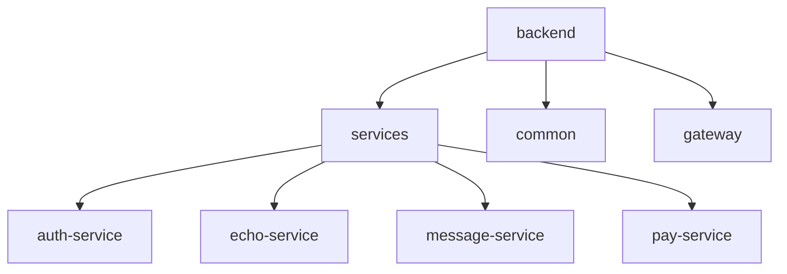

# 项目文档


## 📖 项目简介

### 1. 项目背景

在《鸣潮》这款游戏中，**声骸**是指一种具有特殊能力和属性的虚拟生物

一个声骸具有的属性如下：

* 1 个主词条
* 1 个 `Cost` 值
* 5 个副词条


系统会根据其属性值与角色的匹配程度（相对应的词条权重）来为其评分

一个角色最多可穿戴 5 个声骸，且声骸的总 `Cost` 值不得大于 12

### 2. 项目目的

用于帮助玩家为自己喜欢的角色搭配出最合适的一套声骸组合

帮助玩家作出决策，优化角色、提高战斗能力

### 3. 项目说明

1. 项目只关心声骸的副词条属性，并且以此为依据作出评分

2. 项目不关心声骸的技能，主词条属性，套装效果等等

3. 项目默认属性：

   * 角色：
     * 五星角色：90 级，0 共鸣链，满技能
     * 四星角色：90 级，6 共鸣链，满技能
   * 武器：对应角色专武 90 级（武器可以去角色基础属性模块设置），谐振 1 阶

   * 声骸：5 星的满调谐声骸

4. 目前有绝大部分的角色默认权重都由搜寻攻略得出，等我养到了再进行人工配置


## 🚀 快速开始

### ⚙️ 环境要求

|   环境     |   版本    | 服务端口 |     备注     |
| :-------: | :------: | :------: | :----------: |
|    JDK    |    17    |    -     |   严格匹配   |
|  Node.js  | 20.16.0  |    -     |  LTS版本     |
|   MySQL   |   5.7    |   3306   |  最低要求    |
|   Redis   |  5.0+    |   6379   |  兼容版本    |
| RabbitMQ  |   3.8    |   5672   | 管理端口 15672 |
|   Nacos   |  2.4.3   |   8848   |  服务注册中心  |
| Sentinel  |  1.8.8   |   8080   |  流量控制台   |
|   Seata   |  2.1.0   |   8091   | 管理端口 7091 |
|  cpolar   |    -     |   4000   | 内网穿透工具  |

❗ **版本警告**：

本项目使用 **精确版本锁定** 策略，若使用更高版本组件可能导致兼容性问题

（测试通过版本见上文，建议使用相同版本避免环境问题）

### 🔧 启动步骤

#### 1. 中间件服务启动

* **Redis**：（需本地安装）

  ```sh
  redis-server 
  ```

* **RabbitMQ**：（需本地安装）

  ```sh
  rabbitmq-server
  ```
  
  访问管理台：http://localhost:15672

* **Nacos**：（需本地安装）

  ```sh
  cd nacos/bin
  startup.cmd -m standalone
  ```
  
  访问控制台：http://localhost:8848/nacos

* **Sentinel**：（需本地安装）

  ```sh
  java -jar sentinel-dashboard-1.8.8.jar
  ```
  
  访问控制台：http://localhost:8080
  
  账户：sentinel
  
  密码：sentinel

* **Seata**：（需本地安装）

  ```sh
  cd seata/bin
  seata-server.bat
  ```
  
  访问控制台：http://localhost:7091
  
  账户：seata
  
  密码：seata

#### 2. 数据库初始化

```sh
# 创建所有服务数据库（需逐个执行）
mysql -u root -p -e "CREATE DATABASE auth_service_db CHARACTER SET utf8mb4;"
mysql -u root -p -e "CREATE DATABASE echo_service_db CHARACTER SET utf8mb4;"
mysql -u root -p -e "CREATE DATABASE message_service_db CHARACTER SET utf8mb4;"
mysql -u root -p -e "CREATE DATABASE pay_service_db CHARACTER SET utf8mb4;"

# 导入各服务表结构（注意替换实际路径）
mysql -u root -p auth_service_db < ./sql/auth_service_db.sql
mysql -u root -p echo_service_db < ./sql/echo_service_db.sql
mysql -u root -p message_service_db < ./sql/message_service_db.sql
mysql -u root -p pay_service_db < ./sql/pay_service_db.sql
```

**可视化操作指南**

1. 新建连接 -> 输入 root/123456

2. 逐个创建以下数据库：

   |     数据库名称     |      字符集/排序规则       |
   | :----------------: | :------------------------: |
   |  auth_service_db   | utf8mb4/utf8mb4_general_ci |
   |  echo_service_db   | utf8mb4/utf8mb4_general_ci |
   | message_service_db | utf8mb4/utf8mb4_general_ci |
   |   pay_service_db   | utf8mb4/utf8mb4_general_ci |

3. 逐个双击数据库 -> 右键运行对应SQL文件

#### 3. 内网穿透配置
```sh
# 启动 cpolar（需本地安装）
cd D:\software\cpolar # （注意替换实际路径）
cpolar.exe http 4000 # 生成公网地址后，替换 pay-service 服务 application-alipay.yml 中的 notifyUrl
```

#### 4. 修改配置文件

⚠️ **支付宝沙箱必改项**

修改 `pay-service` 的 `application-alipay.yml`：

```yml
alipay:
  easy:
    appId: [替换为您的沙箱APPID]
    merchantPrivateKey: [替换为您的应用私钥]
    alipayPublicKey: [替换为支付宝公钥]
    notifyUrl: [替换为您的cpolar穿透地址]/api/pay/notify
```
⚠️ **邮箱必改项**

修改 `message-service` 的 `application-email.yml`：

```yml
spring:
  mail:
    host: smtp.163.com
    username: [替换为您的邮箱账号]
    password: [替换为您的邮箱密码]
    port: 465
    properties:
      from: [替换为您的邮箱账号]
      mail:
        smtp:
          socketFactory:
            class: javax.net.ssl.SSLSocketFactory
```

#### 5. 后端服务启动
```sh
# 网关服务
cd gateway
mvn spring-boot:run # 端口 4000

# 各微服务（需分别启动）
cd services/auth-service
mvn spring-boot:run # 端口 4050

cd services/echo-service
mvn spring-boot:run # 端口 4060

cd services/message-service
mvn spring-boot:run # 端口 4070

cd services/pay-service
mvn spring-boot:run # 端口 4080
```

#### 6. 前端启动
```bash
cd frontend
npm install
npm run dev
```

访问地址：http://localhost:5173 即可

⚠️ 注意事项

1. MySQL 账号默认为 `root/123456`，若不同需修改各服务 `application-datasource.yml`
2. Nacos 需保持运行状态，否则服务注册将失败
3. 支付宝沙箱配置需自行申请应用 ID 和密钥，并替换 `application-alipay.yml` 中的敏感信息
4. 本地开发时建议关闭防火墙，确保中间件端口可访问


## 📌 使用说明

在线访问地址：http://8.138.214.176:5173

本地访问地址：http://localhost:5173

### ➤ 账号体系说明

#### 1. 注册账号

点击前往**注册账号**


**填写用户名，密码等相关信息**后，完成**我是人类**验证，再点击**获取验证码**

大概半分钟后，系统就会发送验证码至你的邮箱

验证码三分钟之内有效，一分钟内不得重复获取验证码


#### 2. 登录界面

填写**用户名 / 邮箱 + 密码**进行登录

可以勾选**记住我**功能（用户在登录后的一段时间内，只要不退出登录，则不需要验证，就可以直接登录）


#### 3. 忘记密码

点击前往**忘记密码**模块


首先需要**进行电子邮件的验证**，依然是通过验证码的形式


之后**填写新密码**即可


#### 4. 退出登录

鼠标悬浮在右上角头像处

触发下拉菜单，**点击退出登录**即可退出系统


#### 5. 注销用户

同上，**点击注销用户**将会注销用户

* **注意：**这将会清空该用户的全部信息，无法撤销！


#### 6. 修改用户信息

**点击修改用户信息**，会出现表单模块


用户可以自由选择需要修改什么信息，不填写的默认不进行修改

只有当需要修改用户邮箱时，需要填写的新邮箱的验证码

提交后修改生效，系统会自动退出登录，用户需要重新登陆


### ➤ 各模块特殊说明

#### 1. 筛选条件


筛选规则：行与行之间为逻辑与，行内元素之间为逻辑或

开启筛选后，角色的平均分计算规则也会改变

#### 2. 声骸列表

在此展示角色的声骸列表，一个角色最多配佩戴 5 个声骸，且 Cost 总值最多为 12

鼠标放在声骸的得分单元格时，会出现**修改声骸**和**移除声骸**按钮


每个参数的含义如下：


#### 3. 临时列表

鼠标放在声骸的得分单元格时，会出现**修改声骸 / 添加声骸**和**移除声骸**按钮


最左侧为声骸数据，右侧为该声骸搭配在不同角色身上的评分情况

临时声骸列表中的数据，不计入后面的数据统计模块，相当于一个暂存区，玩家可以在这里对声骸进行横向比对

选择好要给哪位角色后，可以直接将该声骸一键添加至正式的角色声骸列表中，添加后会自动将该声骸从临时声骸列表移除

特别的，开启角色筛选后，横向排序规则将会改为按角色名称进行排序

#### 4. 角色声骸

##### 4.1 声骸属性


右侧表格的数据为：根据声骸列表中，该名角色的所有声骸的全部副词条属性的累加

##### 4.2 副词条平均加点次数


> 角色的副词条平均加点次数的计算公式：
> $$
> \overline{cnt} = \frac{sum}{\overline{x}}
> $$
>
> * $\overline{cnt}$ ：角色的副词条平均加点次数
> * $sum$ ：角色的该项副词条的取值之和
> * $\overline{x}$ ：该项副词条调谐一次的期望取值

##### 4.3 副词条标准化偏差


> 副词条标准化偏差的计算公式：
> $$
> D = \frac{sum}{n\cdot\overline{x}}\times100\%
> $$
>
> * $D$ ：副词条标准化偏差
> * $sum$ ：该项副词条的取值之和
>
> * $n$ ：该项副词条的出现次数
>
> * $\overline{x}$ ：该项副词条调谐一次的期望取值

**含义：**

* 如果这个值比较低，说明你每次调谐的时候，这个副词条的取值普遍较低

* 如果这个值比较高，说明你每次调谐的时候，这个副词条的取值普遍较高

#### 5. 声骸汇总

##### 5.1 声骸评级


声骸评级的含义如下：

| 声骸评级 |         含义          |
| :------: | :-------------------: |
|    F     |  0 <= 声骸评分 < 30   |
|    D     |  30 <= 声骸评分 < 40  |
|    C     |  40 <= 声骸评分 < 50  |
|    B     |  50 <= 声骸评分 < 60  |
|    A     |  60 <= 声骸评分 < 70  |
|    S     |  70 <= 声骸评分 < 80  |
|    SS    |  80 <= 声骸评分 < 90  |
|   SSS    | 90 <= 声骸评分 <= 100 |

##### 5.2 声骸词条标准化偏差


同副词条标准化偏差

#### 6. 词条权重

##### 6.1 词条权重峰度


> 角色的词条权重峰度（这里指的是过剩峰度）的计算公式：
> $$
> μ = \frac{1}{n} \sum_{i=1}^{n} x_i
> $$
>
> $$
> σ=\sqrt{\frac{1}{n} \sum_{i=1}^{n} (x_i - \mu)^2}
> $$
>
> $$
> μ_4=\frac{1}{n} \sum_{i=1}^{n} (x_i - \mu)^4
> $$
>
> $$
> γ_2= \frac{\mu_4}{\sigma^4} - 3
> $$
>
> 
>
> * $γ_2$ ：角色的词条权重峰度
> * $n$ ：副词条的种数，目前为 13
> * $x_i$ ：角色的第 $i$ 项副词条的权重
> * $σ$ ：角色的词条权重标准差
> * $μ_4$ ：角色的词条权重四阶中心矩

**含义：**

* 如果这个值比较低，说明这个角色的词条权重分布较为平滑，更易于养成

* 如果这个值比较高，说明这个角色的词条权重分布较为尖锐，更难以养成

##### 6.2 副词条权重占比


默认词条权重的规则：

> $w(i)$：词条 $i$ 的权重

1. $w(i)$ 的取值范围为 $[0, 100]$
2. 确定对角色毫无贡献的副词条的权重为 $0$，对角色最有贡献的副词条的权重为 $100$
3. 其余的副词条权重，以最大值 $100$ 为基准计算相对比值
4. 一般情况下，对于主 C 角色：
   1. $w(暴击率) = w(暴击伤害) = 100$
   2. $w(百分比攻击) = 71$
5. 对于全部角色：
   1. $w(百分比攻击) > w(伤害加成)$
   2. $w(固定属性) = c * w(百分比属性)$

#### 7. 角色基础属性

**点击武器图像**后，设置武器模块会弹出


点击即可设定该名角色的武器（不点击默认不进行更改）

关闭抽屉页面后设定生效


#### 8. VIP支付系统（沙箱环境说明）

为保障用户资金安全及遵守支付平台规范，特此说明：

1. **开发背景**：本系统为开发者学习支付宝API对接所构建的技术demo，仅用于测试环境验证支付流程
2. **沙箱环境**：因个体开发者资质限制，当前采用支付宝官方提供的沙箱测试环境，所有资金流转均为模拟数据，不会产生真实交易
3. **资金安全**：测试环境中使用的"支付账户"为虚拟账号，系统不会收集/使用任何真实支付信息
4. **功能限制**：本环境不支持真实货币结算，支付成功状态仅用于验证技术流程，请勿将其视为真实支付服务

*温馨提示：如需体验完整支付流程，可使用支付宝沙箱版APP（[沙箱环境 - 支付宝文档中心](https://opendocs.alipay.com/common/02kkv7?pathHash=9a45a6d6)）配合测试。感谢您的理解与支持！*


使用支付宝沙箱版APP，扫这个二维码去付款，点击《我已完成支付》


未支付响应：


支付成功响应：


即可解锁VIP专属特权：

1. 金色昵称
2. 金色头像框


#### 9. 导入声骸数据

还是右上角头像处，**点击导入声骸数据**，会出现表单模块


相关参数的获取可以参考这个教程：[ProxyPin使用教程](http://8.138.214.176:5173/ProxyPin使用教程.html)

输入相关参数后，点击提交


等待数据抓取，期间不要刷新页面

抓取成功后数据自动导入到声骸列表


⚠️ 特殊说明：**只会抓取5星满级满调谐的声骸**


## 🔍 原理讲解

### 1. 副词条权重的计算

#### 1.1 鸣潮总伤害计算公式

鸣潮总伤害计算公式：
$$
总伤害 = ((角色基础数值 + 武器基础数值) \times (1 + 百分比攻击) + 固定攻击) \times 暴击伤害 \times (1 + 属性伤害加成 + 技能伤害加成) \times 技能倍率 \times (1 + 倍率提升) \times (1 + 伤害加深) \times \frac{100 + 角色等级}{199 + 角色等级 + 怪物等级} \times (1 - 属性抗性) \times (1 - 属性伤害减免)
$$
如果我们只关注与声骸副词条有关的部分，那么简化后的计算公式为：
$$
总伤害 = ((角色基础数值 + 武器基础数值) \times 百分比攻击 + 固定攻击) \times 暴击伤害 \times 技能伤害加成
$$

#### 1.2 百分比攻击，暴击伤害，技能伤害加成的权重计算

根据上式可知，百分比攻击，暴击伤害，技能伤害加成都是正相关

> $x(i)$ ：副词条 $i$ 调谐一次的期望取值
>
> $w(i)$ ：副词条 $i$ 的权重

已知 $x(暴击伤害) = 16.8，x(百分比攻击) = x(技能伤害加成) = 9.0$

有 $\frac{w(暴击伤害)}{w(百分比攻击)} = \frac{x(暴击伤害)}{x(百分比攻击)}$

定义 $w(暴击伤害) = 100$，取暴击期望为 $50\%$，根据上式四舍五入计算出 $w(百分比攻击) = 71$

虽然 $x(百分比攻击) = x(技能伤害加成)$

但是百分比攻击可以作用于所有出伤，因此才会有 $w(百分比攻击) = w(普攻伤害加成) + w(重击伤害加成) + w(共鸣技能伤害加成) + w(共鸣解放伤害加成)$ 这一结论

#### 1.3 固定属性的权重计算

以固定属性做一个标准化

有 $\frac{w(固定属性)}{w(百分比属性)} = \frac{x(固定属性)}{x(百分比属性) \times (角色基础数值 + 武器基础数值)}$

### 2. 声骸评分算法

#### 2.1 计算理论最大分数

1. 选择权重最大的 5 项副词条

2. 将它们的取值都取理论最大值

3. 单项副词条的得分点数计算公式：

   > $$
   > s = \frac{x}{\overline{x}} \times \frac{w}{sum(w)}
   > $$
   >
   > * $s$ ：单项副词条的得分点数
   > * $x$ ：该项副词条的实际取值
   > * $\overline{x}$ ：该项副词条调谐一次的期望取值
   > * $w$ ：该项副词条的权重
   > * $sum(w)$ ：该角色权重最大的 5 项副词条权重之和

4. 累加每项副词条的得分点数得到理论最大分数

#### 2.2 计算最终声骸评分

1. 根据上面的计算规则，将取值替换为实际取值，计算得出实际分数

2. 最终声骸评分的计算公式：

   > $$
   > 最终声骸评分 = \frac{实际分数}{理论最大分数} \times 100
   > $$

所以，最终声骸评分的取值范围为 $[0, 100]$

#### 2.3 计算副词条对评分的贡献百分比

副词条对评分的贡献百分比的计算公式：

   > $$
   > 副词条对评分的贡献百分比 = \frac{该项副词条的得分点数}{总的得分点数} \times 100\%
   > $$

### 3. 理论基础支撑

鸣潮总伤害计算公式：[【鸣潮】伤害论 伤害乘区与稀释详解 怎么样才能最大化输出？《鸣潮》底层机制系列01](https://www.bilibili.com/video/BV1VZ42147px/?spm_id_from=333.999.0.0&vd_source=50647b976189fed7c41a37586097b659)


角色默认词条权重：

* [【鸣潮】最新全角色声骸养成作业 武器&共鸣链收益计算 含声骸词条思路规则_哔哩哔哩bilibili](https://www.bilibili.com/video/BV1Tf421X7fm/?spm_id_from=333.999.0.0)

* [【鸣潮】长离强度解析+养成作业 声骸词条/共鸣链/武器分析](https://www.bilibili.com/video/BV1nM4m1y718/?spm_id_from=333.999.0.0)

* [【鸣潮】守岸人解析 百搭暴力人权拐！强度解析＋养成作业：声骸词条 共鸣链 武器分析](https://www.bilibili.com/video/BV1RqxBepEs7/?spm_id_from=333.999.0.0&vd_source=50647b976189fed7c41a37586097b659)

* [【鸣潮】椿解析 首位常态双形态！养成作业+进阶技巧：声骸词条 共鸣链 武器分析_哔哩哔哩bilibili](https://www.bilibili.com/video/BV1RmU3YnEMF/?spm_id_from=333.999.0.0&vd_source=50647b976189fed7c41a37586097b659)
* ......

在此感谢这三位 B 站 UP 主：

* [青空の霞光 bilibili](https://space.bilibili.com/37737161?spm_id_from=333.337.0.0)

* [叫我棉被-哔哩哔哩_bilibili](https://space.bilibili.com/6014992?spm_id_from=333.337.0.0)

* [金铃子攻略组-哔哩哔哩_bilibili](https://search.bilibili.com/all?keyword=金铃子攻略组&from_source=webtop_search&spm_id_from=333.1007&search_source=2)


## 🛠️ 技术栈

### 后端

- **框架**：
  - **核心框架**：Spring Boot、Spring MVC、Spring Security、MyBatis
  - **微服务框架**：Spring Cloud Gateway、Spring Cloud OpenFeign、Nacos
- **数据库**：MySQL、Redis
- **第三方库**：Lombok、Fastjson、Apache Commons Math3、Sentinel
- **安全**：Spring Security、BCryptPasswordEncoder、Remember-Me 机制
- **工具与功能：**
  - **服务治理**：Nacos 服务注册与发现
  - **全局功能**：网关请求日志、拦截器
  - **异常处理**：全局异常拦截、Sentinel 限流熔断
  - **服务通信**：Feign 客户端、负载均衡
  - **事务管理**：Spring 事务、Seata 分布式事务

### 前端

- **框架**：Vue 3
- **状态管理**：Pinia
- **UI 组件库**：Element Plus、Element Plus Icons
- **路由**：Vue Router
- **HTTP 请求库**：Axios
- **构建工具**：Vite
- **功能与工具**：
  - **复杂表单验证**：Element Plus 表单规则 + 自定义校验逻辑（如用户名特殊字符检测、邮箱格式校验）
  - **动画效果**：Element Plus 过渡动画（`<transition>` 组件）
  - **人机验证**：hCaptcha 集成（第三方验证服务）
  - **响应式设计**：Flex 布局 + 媒体查询（适配移动端）
  - **交互反馈**：Element Plus 消息提示（`ElMessage`）、通知（`ElNotification`）、确认弹窗（`ElMessageBox`）
  - **异步处理**：`async/await`（网络请求协同）
  - **辅助工具**：ElBacktop（返回顶部组件）、SVG 图标动态渲染、CSS 动画（如 VIP 特效）


## ✨技术栈亮点

### 后端

#### 1. 微服务架构下的云就绪方案

**亮点描述：**  

- **智能路由与动态发现**：`lb://`协议实现服务自动注册发现，支持多业务模块（认证/声骸/消息/支付）的负载均衡路由
- **多环境治理能力**：基于Nacos命名空间隔离开发/测试/生产环境，配置文件按环境动态加载（见Profile分段配置）  
- **毫秒级链路追踪**：全局过滤器实现请求生命周期监控（见RtGlobalFilter日志埋点），精准统计API耗时  
- **分布式系统韧性**：集成Sentinel流量哨兵，可视化控制台实时观测服务健康状态（Dashboard:8080）  

**代码片段：**

```yml
# 跨域配置与业务路由定义
spring:
  cloud:
    gateway:
      globalcors:
        cors-configurations:
          '[/**]':
            allowed-origin-patterns: "http://8.138.214.176:5173"
            allowed-headers: '*'
            allowed-methods: '*'
            allow-credentials: true
      routes: # 五组业务路由配置
        - id: auth
          uri: lb://auth-service # 负载均衡协议
          predicates:
            - Path=/api/auth/**
        - id: user
          uri: lb://auth-service
          predicates:
            - Path=/api/user/**
        - id: echo
          uri: lb://echo-service
          predicates:
            - Path=/api/echo/**
        - id: message
          uri: lb://message-service
          predicates:
            - Path=/api/message/**
        - id: pay
          uri: lb://pay-service
          predicates:
            - Path=/api/pay/**
```

```yml
# 支付服务核心配置
server:
  port: 4080
spring:
  profiles:
    active: dev # 多环境配置开关
    include:
      - datasource
      - alipay
      - client
      - redis
      - seata
  application:
    name: pay-service
  cloud:
    nacos:
      server-addr: localhost:8848 # 注册中心地址
      config:
        import-check:
          enabled: false
        namespace: ${spring.profiles.active:public} # 环境隔离关键配置
        discovery:
          ip: localhost
          port: ${server.port}
    sentinel:
      transport:
        dashboard: localhost:8080 # 熔断监控入口
      eager: true
logging:
  level:
    com.pay.client: info

---
spring:
  config:
    import:
      - nacos:database.properties?group=pay
    activate:
      on-profile: dev
---
spring:
  config:
    import:
      - nacos:database.properties?group=pay
    activate:
      on-profile: test
---
spring:
  config:
    import:
      - nacos:database.properties?group=pay
    activate:
      on-profile: prod
```

```java
@Component
@Slf4j
public class RtGlobalFilter implements GlobalFilter, Ordered { // 链路追踪过滤器实现

    @Override
    public Mono<Void> filter(ServerWebExchange exchange, GatewayFilterChain chain) {
        ServerHttpRequest request = exchange.getRequest();
        String uri = request.getURI().toString();
        long start = System.currentTimeMillis();
        log.info("请求 {} 开始", uri); // 请求入口日志
        return chain.filter(exchange).doFinally((result) -> { // 耗时计算
            long end = System.currentTimeMillis();
            log.info("请求 {} 结束，耗时：{}ms", uri, end - start);
        });
    }

    @Override
    public int getOrder() {
        return 0;
    }
}
```

#### 2. 声明式服务治理与熔断降级体系

**亮点描述：**  

- **注解驱动服务调用**：通过`@FeignClient`声明式接口定义，自动完成HTTP请求编解码，实现业务代码与通信逻辑解耦  
- **双层级熔断保护**：方法级Fallback实现快速降级，服务不可用时返回预设安全值，保障核心链路可用性  
- **智能流量调度**：无缝继承Spring Cloud服务发现能力，基于注册中心实例状态自动路由，内置轮询负载策略  

**代码片段：**  

```java
@Configuration
public class FeignConfig {
    
    @Bean
    Logger.Level feignLoggerLevel() { // 仅记录请求方法、URL和响应状态码
        return Logger.Level.BASIC;
    }

    @Bean
    Retryer retryer() { // 重试策略完全关闭
        return new Retryer.Default(0, 0, 0);
    }
}
```

```java
// 服务契约声明：name关联注册中心服务ID，path定义API根路径
@FeignClient(name = "auth-service",
             path = "/api/auth",
             fallback = AuthClientFallback.class) // 熔断时切换降级实现类
public interface AuthClient {

    @GetMapping("/get-account")
    Account getAccount(@RequestParam("username") String username); // 声明式HTTP GET映射

    @GetMapping("/is-vip")
    Boolean isVip(@RequestParam("username") String username); // 参数自动URL编码
}
```

```java
@Component
public class AuthClientFallback implements AuthClient {
    
    @Override
    public Account getAccount(String username) { // 熔断降级实现：返回空账户
        return new Account(); // 安全兜底数据
    }

    @Override
    public Boolean isVip(String username) { // 服务不可用时默认返回非VIP状态
        return Boolean.FALSE;
    }
}
```

#### 3. **基于全局事务锁的多维数据治理方案**

**亮点描述：**

- **全链路事务锁机制**：采用 Seata AT 模式实现跨服务、跨数据源的分布式事务原子性，通过`@GlobalTransactional`注解实现事务边界的精准界定
- **元数据驱动级联操作**：基于数据库元数据（information_schema）动态识别业务表结构，实现用户维度的全链路数据级联清理
- **多服务操作聚合**：在单事务边界内聚合核心业务服务（用户服务、支付服务）及数据库层操作，保障服务间状态一致性

**代码片段：**

```java
@Override
@Transactional // 声明本地事务
@GlobalTransactional // 声明分布式事务
public void signout(String username) { 
    // 元数据驱动清理：动态获取所有包含username字段的业务表
    for (String tableName : dataGovernanceMapper.findAllTables()) {
        // 动态SQL构建：通过<table_name>占位符实现多表适配
        dataGovernanceMapper.deleteAccountByUsername(tableName, username);
    }
    // 跨服务调用：整合认证服务和支付服务的事务操作
    echoClient.signout(username); // 认证服务注销
    payClient.signout(username); // 支付账户注销
}
```

```java
@Mapper
public interface DataGovernanceMapper {
    // 元数据扫描：基于information_schema自动发现业务表
    @Select("select distinct table_name from information_schema.COLUMNS " +
            "where table_schema = 'auth_service_db' and column_name = 'username'")
    List<String> findAllTables();

    // 动态SQL模板：支持运行时表名注入，${}语法实现表级操作扩展
    @Delete("<script>" +
            "delete from ${table_name} where username = #{username}" +
            "</script>")
    void deleteAccountByUsername(String table_name, String username);

    // 复用模板设计：相同范式支持数据重置等扩展场景
    @Update("<script>" +
            "update ${table_name} set username = #{username} where username = #{old_username}" +
            "</script>")
    void resetUsername(String table_name, String username, String old_username);
}
```

#### 4. 零信任架构下的动态安全控制体系

**技术亮点：**

- **URL级访问控制**：通过接口级路径匹配规则实现细粒度鉴权（`/api/auth/**`开放，其余强制认证）
- **混合认证状态管理**：Spring Security会话机制 + 拦截器上下文绑定，支持无状态RESTful接口与状态会话共存
- **持久化双因素验证**：RememberMe功能集成持久化令牌仓库，实现15天有效期的设备记忆验证

**代码片段：**

```java
// 核心安全策略链配置
@Bean
public SecurityFilterChain filterChain(HttpSecurity http,
                                       PersistentTokenRepository repository) throws Exception { 
    return http
            // 接口级访问控制：白名单与强制认证策略
            .authorizeHttpRequests(e -> e 
                    .requestMatchers("/api/auth/**").permitAll() // 认证相关接口开放
                    .requestMatchers("/api/pay/notify").permitAll() // 支付回调接口开放
                    .anyRequest().authenticated() // 其他接口要求认证
            )
            // 认证状态管理：登录/注销终结点与处理器
            .formLogin(e -> e 
                    .loginProcessingUrl("/api/auth/login") // 统一认证入口
                    .successHandler(this::onAuthenticationSuccess) // 认证成功回调
                    .failureHandler(this::onAuthenticationFailure) // 认证失败回调
            )
            // 会话生命周期控制
            .logout(e -> e 
                    .logoutUrl("/api/auth/logout") // 统一注销入口
                    .logoutSuccessHandler(this::onAuthenticationSuccess) // 注销成功回调
            )
            // 持久化设备记忆验证
            .rememberMe(e -> e 
                    .rememberMeParameter("remember") // 前端触发参数
                    .tokenRepository(repository) // 令牌存储策略
                    .tokenValiditySeconds(3600 * 24 * 15) // 15天有效期
            )
            // 安全防御策略
            .csrf(AbstractHttpConfigurer::disable) // 根据REST API特性关闭CSRF
            .exceptionHandling(e -> e.authenticationEntryPoint(this::onAuthenticationFailure)) // 统一认证异常处理
            .build();
}
```

```java
// 会话上下文增强拦截器
@Component
public class AuthorizeInterceptor implements HandlerInterceptor { 

    @Resource
    UserMapper mapper;

    // 请求预处理：绑定认证上下文到会话
    @Override
    public boolean preHandle(HttpServletRequest request, HttpServletResponse response, Object handler) {
        Authentication authentication = SecurityContextHolder.getContext().getAuthentication();
        if (authentication != null && authentication.isAuthenticated()) {
            User user = (User) authentication.getPrincipal(); // 提取安全上下文
            AccountUser account = mapper.findAccountUserByNameOrEmail(user.getUsername()); // 扩展用户信息
            request.getSession().setAttribute("account", account); // 会话绑定完整用户对象
        }
        return true;
    }
}
```

#### 5. 基于Redis的分布式验证码控制体系

**亮点描述：**

* **请求幂等性保障**：采用SETNX原子指令构建防重放攻击体系，通过复合键设计(email+sid+状态)实现三维度请求标识
* **阶梯式流控策略**：双重时效校验机制（3分钟总窗口期+60秒冷却期）精确管控业务频率

**代码描述：**

```java
@Override
public String sendValidateEmail(String email, String sessionId, boolean hasAccount) {
    // 构建复合缓存键：客户端会话ID + 邮箱 + 账户状态
    String key = "email:" + sessionId + ":" + email + ":" + hasAccount;
    // 第一阶段：原子性抢占操作（SETNX实现分布式锁）
    if (Boolean.TRUE.equals(template.opsForValue().setIfAbsent(key, "pending", 3, TimeUnit.MINUTES))) {
        String code = String.format("%06d", new Random().nextInt(1000000)); // 验证码生成
        template.opsForValue().set(key, code, 3, TimeUnit.MINUTES);
        messageClient.sendCodeEmail(email, code); // 异步通知链路
        return null;
    } else {
        // 第二阶段的时效分级管控
        Long expire = template.getExpire(key, TimeUnit.SECONDS);
        if (expire != null && expire > 120) { // 精确到秒级的剩余时间判断
            return "请求过于频繁，请稍后再试"; // 冷却期提示
        }
        return "已有请求正在处理，请勿重复提交"; // 处理中提示
    }
}
```

#### 6.  分布式服务限流与熔断降级机制

**亮点描述：**

* **服务熔断降级**：FeignClient声明式熔断策略（Fallback自动激活），异常服务返回预设安全值
* **友好流量治理**：全局流量规则异常处理（429状态码+JSON结构化响应），客户端请求优雅降级

**代码片段：**

```java
// Sentinel统一异常处理
@Component
public class MyBlockExceptionHandler implements BlockExceptionHandler {

    private final ObjectMapper objectMapper = new ObjectMapper();

    @Override
    public void handle(HttpServletRequest request, HttpServletResponse response,
                       String resourceName, BlockException e) throws Exception {
        response.setStatus(429);  // HTTP 429 状态码
        response.setContentType("application/json;charset=utf-8");
        PrintWriter writer = response.getWriter();
        R error = R.error(429, resourceName + "被Sentinel限制了，原因：" + e.getClass());
        String json = objectMapper.writeValueAsString(error);
        writer.write(json);
        writer.flush();
        writer.close();
    }
}
```

```yml
# Feign与Sentinel集成配置
spring:
  cloud:
    openfeign:
      client:
        config:
          default:
            logger-level: full
            connect-timeout: 5000 # 连接超时控制
            read-timeout: 10000 # 读取超时控制
feign:
  sentinel:
    enabled: true # 熔断器开关
```

#### 7. **智能评分算法引擎**

**亮点描述：**

- **动态权重模型**：支持用户自定义角色属性权重，Z-Score标准化评估体系
- **数据驱动优化**：实时计算声骸装备相对偏差值，多维属性联动分析
- **可视化配置**：JSON动态配置筛选条件，支持复杂业务场景扩展

**代码片段：**

```java
public interface EchoScoringSystemService {

    String[] getEchoKeys(); // 获取副词条名称
    Map<String, double[]> getEchoValues(); // 获取副词条取值
    Map<String, Double> getEchoAverage(); // 获取副词条基准值

    Map<String, Weapon> getWeapons(); // 获取武器
    List<Weapon> getWeaponsByScreen(String json); // 获取筛选后的武器
    void setWeapon(String username, String name, String weapon); // 设置角色武器

    Map<String, Character> getCharacters(String username); // 获取角色
    Map<String, Character> getCharactersByScreen(String username, String json); // 获取筛选后的角色
    List<String> getNames(); // 获取角色名称列表
    Map<String, List<String>> getCharacterGroupsByType(); // 获取角色分组
    Map<String, int[]> getCharacterStats(); // 获取角色三维属性
    Map<String, ? extends Number> getweightsByUsername(String username, String name); // 获取角色完整副词条权重
    void setweights(String username, String name, String json); // 设置角色副词条权重
    void reweights(String username, String name); // 重置角色副词条权重

    Map<String, Number> getEchoPercent(String username, String name, String json); // 获取声骸评分

    Map<String, List<Echo>> getData(String username); // 获取角色词条数据
    Map<String, List<Echo>> getDataByScreen(String username, String json); // 获取筛选后的角色词条数据
    Map<String, List<Echo>> addData(String username, String json, String name); // 添加角色声骸数据
    Map<String, List<Echo>> delEcho(String username, Integer index, String name); // 删除角色声骸数据
    Map<String, List<Echo>> reData(String username); // 重新计算角色声骸数据
    List<Map<String, String>> getEchoStats(String username); // 获取声骸属性

    int[] getEchoCnts(String username); // 获取声骸总数
    Map<String, Integer> getEchoRelativeDeviation(String username); // 获取声骸标准化偏差
    Map<String, Integer> getEchoRelativeDeviation(String username, String name); // 获取角色声骸标准化偏差
    Map<String, Double> getWeightKurtosis(String username); // 获取权重过剩峰度

    void addTempEcho(String username, String echo, String nameList); // 添加临时声骸
    List<Map<String, Echo>> getTempData(String username); // 获取临时数据
    List<Map<String, Echo>> getTempDataByScreen(String username, String json);
    void delTempSubEcho(String username, String json, String name); // 移除临时声骸角色
    void delTempEcho(String username, String json); // 移除临时声骸

    void batchImportEcho(String username, List<RoleDTO> roles, Boolean isDelete); // 批量导入声骸
}
```

```java
@Data
@AllArgsConstructor
public class Echo { // 声骸

    public String main;
    public String cost;
    public List<List<String>> echo;
    public String score;

    public static Echo getEmpty() {
        List<List<String>> echo = new ArrayList<>();
        for (int i = 0; i < 5; i++) {
            List<String> tmp = new ArrayList<>(Arrays.asList("", "", ""));
            echo.add(tmp);
        }
        return new Echo("", "", echo, "");
    }

    public static Echo getCloned(Echo echo) {
        Echo res = getEmpty();
        res.main = echo.main;
        res.cost = echo.cost;
        res.score = echo.score;
        List<List<String>> list = new ArrayList<>();
        for (int i = 0; i < 5; i++) {
            List<String> tmp = new ArrayList<>(echo.echo.get(i));
            list.add(tmp);
        }
        res.echo = list;
        return res;
    }
}
```

```java
@Override
public Map<String, Number> getEchoPercent(String username, String name, String json) { // 获取声骸评分
    Map<String, Number> values = JSON.parseObject(json, new TypeReference<Map<String, Number>>() {});
    Map<String, ? extends Number> weights = getweightsByUsername(username, name); // 角色完整副词条权重
    Map<String, Number> res = new LinkedHashMap<>();
    List<Map.Entry<String, Double>> pairs = new ArrayList<>();
    for (String key: ECHO_KEYS) {
        double value = weights.get(key).doubleValue() * ECHO_VALUES.get(key)[0] / ECHO_AVERAGE.get(key);
        pairs.add(new AbstractMap.SimpleEntry<>(key, value));
    }
    pairs.sort(Map.Entry.comparingByValue(Comparator.reverseOrder()));
    double maxScore = pairs.stream().limit(5).mapToDouble(Map.Entry::getValue).sum(); // 理论最大分数
    double myScore = 0; // 实际分数
    for (String key: values.keySet()) {
        double score = weights.get(key).doubleValue() * values.get(key).doubleValue() / ECHO_AVERAGE.get(key);
        myScore += score;
        res.put(key, score);
    }
    for (String key: values.keySet()) {
        res.put(key, (int) Math.round(res.get(key).doubleValue() * 100 / myScore)); // 每个副词条对总得分的贡献百分比
    }
    res.put("总得分", (int) Math.round(myScore * 100 / maxScore)); // 总得分
    return res;
}
```

#### 8. 分布式消息系统可靠性保障设计

**亮点描述：**

- **消息投递可靠性保障**：采用消息状态日志表（`message_id_log`）与ACK自动重试机制，通过事务型更新确保至少一次投递（`selectMessageIdLog/updateMessageStatus`）
- **精准延迟队列实现**：基于TTL+死信路由链式结构（`x-dead-letter-exchange`），实现订单超时场景的毫秒级事件触发（`e1->q2->e2->q3`路由链路）
- **消费端幂等性控制**：通过全局消息ID状态机（`0/1/2`三态标记），在业务处理前强制校验消息生命周期，规避重复消费风险

**代码片段：**

```java
// 死信路由配置（实现延迟消息重定向）
@Configuration
@ConditionalOnProperty(name = "spring.rabbitmq.listener.simple.retry.enabled", havingValue = "true")
public class ErrorMessageConfig {
	
    // 创建异常消息专用交换器与队列
    @Bean
    public DirectExchange errorExchange() { // 死信消息最终路由节点
        return new DirectExchange("error.direct");
    }

    @Bean
    public Queue errorQueue() { // 异常消息持久化存储
        return new Queue("error.queue", true);
    }

    @Bean
    public Binding errorBinding(Queue errorQueue, DirectExchange errorExchange) { // 建立死信消息路由规则
        return BindingBuilder.bind(errorQueue).to(errorExchange).with("error");
    }

    @Bean
    public MessageRecoverer messageRecoverer(RabbitTemplate rabbitTemplate) { // 全局异常消息收集器
        return new RepublishMessageRecoverer(rabbitTemplate, "error.direct", "error");
    }
}
```

```java
// 延迟队列拓扑配置（TTL+死信路由实现）
@Configuration
public class RabbitConfiguration {

    @Bean
    public MessageConverter messageConverter() { // 配置消息转换器
        Jackson2JsonMessageConverter converter = new Jackson2JsonMessageConverter();
        converter.setCreateMessageIds(true);
        return converter;
    }
	
    // 队列/交换器绑定关系定义...
    @Bean
    public DirectExchange e1() {
        return new DirectExchange("e1");
    }
    @Bean
    public DirectExchange e2() {
        return new DirectExchange("e2");
    }
    @Bean
    public Queue q2() { // 延时队列核心定义
        Map<String, Object> args = new HashMap<>();
        args.put("x-queue-mode", "lazy");
        args.put("x-dead-letter-exchange", "e2"); // 死信目标交换器
        args.put("x-dead-letter-routing-key", "pay_failed.ttl"); // 延时事件路由键
        return new Queue("q2", true, false, false, args); // 启用Lazy Queue模式
    }
    @Bean
    public Queue q3() {
        return new Queue("q3", true);
    }
    @Bean
    public Binding q2Binding(DirectExchange e1, Queue q2) {
        return BindingBuilder.bind(q2).to(e1).with("pay_failed");
    }
    @Bean
    public Binding q3Binding(DirectExchange e2, Queue q3) {
        return BindingBuilder.bind(q3).to(e2).with("pay_failed.ttl");
    }
}
```

```java
// 消息处理层（实现幂等性校验）
@Slf4j
@Component
public class RabbitMQListener {

    @Resource
    AuthClient authClient;

    @Resource
    MessageService messageService;

    @Resource
    MqMapper mqMapper;

    @RabbitListener(bindings = @QueueBinding(
            value = @Queue(name = "q4", arguments = @Argument(name = "x-queue-mode", value = "lazy")),
            exchange = @Exchange(name = "e1"),
            key = {"code"}
    )) // q4监听配置
    public void listenCodeMessage(Map<String, String> msg) { // 发送验证码邮件
        String id = msg.get("id"), email = msg.get("email"), code = msg.get("code");
        Integer status = mqMapper.selectMessageIdLog(id);
        if (status != null && status != 0) return; // 幂等性拦截
        Boolean res = messageService.sendCodeEmail(email, code); // 业务操作
        if (res) mqMapper.updateMessageIdLog(id, 1); // 成功状态持久化
        else {
            mqMapper.updateMessageIdLog(id, 2); // 失败状态标记
            throw new RuntimeException("发送邮件失败"); // 触发重试/死信
        }
    }

    @RabbitListener(bindings = @QueueBinding(
            value = @Queue(name = "q1", arguments = @Argument(name = "x-queue-mode", value = "lazy")),
            exchange = @Exchange(name = "e1"),
            key = {"pay_success"}
    ))
    public void listenPaySuccessMessage(Map<String, String> msg) { // 支付成功通知
        String id = msg.get("id"), username = msg.get("username");
        Integer status = mqMapper.selectMessageIdLog(id);
        if (status != null && status != 0) return;
        Account account = authClient.getAccount(username);
        String email = account.getEmail();
        Boolean res = messageService.sendPaySuccessEmail(email, username);
        if (res) mqMapper.updateMessageIdLog(id, 1);
        else {
            mqMapper.updateMessageIdLog(id, 2);
            throw new RuntimeException("发送邮件失败");
        }
    }

    @RabbitListener(queues = "q3")
    public void listenPayFailedMessage(Map<String, String> msg) { // 订单过期通知
        String id = msg.get("id"), outTradeNo = msg.get("outTradeNo"), username = msg.get("username"), time = msg.get("time");
        Integer status = mqMapper.selectMessageIdLog(id);
        if (status != null && status != 0) return;
        if (authClient.isVip(username)) { // 用户已支付
            mqMapper.updateMessageIdLog(id, 1);
            return;
        }
        Account account = authClient.getAccount(username);
        String email = account.getEmail();
        Boolean res = messageService.sendPayFailedEmail(email, username, time, outTradeNo);
        if (res) mqMapper.updateMessageIdLog(id, 1);
        else {
            mqMapper.updateMessageIdLog(id, 2);
            throw new RuntimeException("发送邮件失败");
        }
    }
}
```

#### 9. 高并发支付系统架构优化实践

**亮点描述：**

- **动态缓存过期策略与防雪崩设计**：通过为缓存设置随机过期时间（30~33分钟），分散缓存失效峰值，规避数据库雪崩风险
- **多级支付状态校验与本地状态前置**：优先通过本地VIP状态快速响应支付查询，未命中时再调用支付宝API
- **零文件IO的内存级二维码生成**：基于ZXing直接生成Base64编码的二维码Data URI，省去文件读写流程

**代码片段：**

```java
// 支付核心服务实现
@Service
public class EasyPayServiceImpl implements EasyPayService {

    @Resource
    Config config;

    @Resource
    StringRedisTemplate template;

    @Resource
    PayMapper payMapper;

    @Resource
    MessageClient messageClient;

    @Resource
    AuthClient authClient;
	
    // 支付主逻辑
    @Override
    @Transactional(rollbackFor = Exception.class)
    public AliPay pay(String username) { // 生成支付二维码
        String lockKey = LOCK_PREFIX + username;
        try {
            // 获取分布式锁，防止缓存击穿
            Boolean isLocked = template.opsForValue().setIfAbsent(lockKey, UUID.randomUUID().toString(), 3, TimeUnit.SECONDS);
            if (Boolean.TRUE.equals(isLocked)) {
                try {
                    if (Boolean.TRUE.equals(template.hasKey(username))) {
                        String json = template.opsForValue().get(username);
                        return JSON.parseObject(json, new TypeReference<AliPay>() {});
                    }
                    Order existingOrder = payMapper.findOrderByUsername(username);
                    if (existingOrder != null && !isOrderExpired(existingOrder)) {
                        return new AliPay(
                                existingOrder.getId(),
                                username,
                                PayUtil.urlToQrcode(existingOrder.getQrUrl())
                        );
                    }
                    String orderId = username + "-" + System.currentTimeMillis();
                    Factory.setOptions(config);
                    AlipayTradePrecreateResponse response = Factory.Payment.FaceToFace().preCreate("声骸评分系统VIP", orderId, "39.99");
                    String httpBody = response.getHttpBody();
                    JSONObject jsonObject = JSON.parseObject(httpBody);
                    String qrUrl = jsonObject.getJSONObject("alipay_trade_precreate_response").getString("qr_code");
                    AliPay aliPay = new AliPay(orderId, username, PayUtil.urlToQrcode(qrUrl));
                    // 删除旧订单并插入新订单（事务内操作）
                    payMapper.deleteOrderByUsername(username);
                    payMapper.insertOrder(new Order(orderId, username, LocalDateTime.now(), qrUrl));
                    String aliPayJson = JSON.toJSONString(aliPay); // 设置缓存（带随机过期时间，防雪崩）
                    int expireMinutes = 30 + new Random().nextInt(3);
                    template.opsForValue().set(username, aliPayJson, expireMinutes, TimeUnit.MINUTES);
                    // 发送延迟消息（30分钟后检查支付状态）
                    Map<String, String> msg = new HashMap<>();
                    msg.put("id", UUID.randomUUID() + "-FAILED");
                    msg.put("outTradeNo", orderId);
                    msg.put("username", username);
                    msg.put("time", LocalDateTime.now().format(DateTimeFormatter.ofPattern("yyyy-MM-dd HH:mm:ss")));
                    messageClient.insertMessageIdLog(msg.get("id"), 0);
                    messageClient.sendDelayedMqMessage("e1", "pay_failed", msg, "1800000"); // 30分钟延迟
                    return aliPay;
                } finally {
                    template.delete(lockKey); // 释放锁
                }
            } else {
                // 获取锁失败，等待后重试（适用于低并发场景）
                Thread.sleep(1000);
                return pay(username);
            }
        } catch (Exception e) {
            log.error("支付二维码生成失败，用户：{}", username, e);
            return null;
        }
    }
	
    // 支付回调
    @Override
    public String notify(HttpServletRequest request) { // 支付成功回调接口
        String outTradeNo = request.getParameter("out_trade_no");
        String username = outTradeNo.substring(0, outTradeNo.indexOf('-'));
        if (Boolean.TRUE.equals(template.hasKey(username))) {
            template.delete(username); // 支付成功立即清除缓存
        }
        authClient.updateVipUser(username); // 核心权益发放
        Map<String, String> msg = new HashMap<>(
                Map.ofEntries(
                        Map.entry("id", UUID.randomUUID() + "-SUCCESS"),
                        Map.entry("outTradeNo", outTradeNo),
                        Map.entry("username", username)
                )
        );
        messageClient.insertMessageIdLog(msg.get("id"), 0);
        messageClient.sendMqMessage("e1", "pay_success", msg); // 事务消息最终通知
        return username + "：Success";
    }
	
    // 支付结果查询（多级校验机制）
    @Override
    public int query(String username, String id) { // 查询支付结果
        if (authClient.isVip(username)) return 1; // 优先校验本地状态
        try { // 支付宝官方查询兜底（异常流量过滤）
            Factory.setOptions(config);
            AlipayTradeQueryResponse query = Factory.Payment.Common().query(id);
            JSONObject jsonObject = JSONObject.parseObject(query.getHttpBody());
            if (jsonObject.getJSONObject("alipay_trade_query_response").get("code").equals("10000")) {
                authClient.updateVipUser(username);
                return 1;
            }
            else return 0;
        } catch (Exception e) {
            return -1;
        }
    }
}
```

```java
public class PayUtil {

    private final static QrConfig QR_CONFIG = new QrConfig(500, 500);
    static {
        QR_CONFIG.setErrorCorrection(ErrorCorrectionLevel.H);
    }

    public static String urlToQrcode(String url) { // URL转二维码base64字符串
        ByteArrayOutputStream baos = new ByteArrayOutputStream();
        String targetType = "jpg";
        QrCodeUtil.generate(url, QR_CONFIG, targetType, baos);
        String base64 = Base64.getEncoder().encodeToString(baos.toByteArray());
        return "data:" + targetType + ";base64," + base64;
    }
}
```

### 前端

#### 1. 高效的状态管理与持久化

> 通过 Pinia 实现全局状态管理，结合持久化插件自动缓存用户登录信息，提升用户体验
>
> 路由守卫动态校验用户状态，未登录用户自动跳转至登录页，保障系统安全性

#### 2. 复杂的表单交互与验证

> 通过组合式 API 封装可复用的表单验证逻辑，支持实时校验、异步接口查重（如邮箱是否注册）和防重复提交
>
> 集成 hCaptcha 验证机制，有效防止机器恶意注册，提升系统安全性

#### 3. 支付流程与异步状态管理

> 基于 Axios 封装支付接口，实现支付宝沙箱环境模拟支付流程
>
> 实时查询订单状态，结合 Element Plus 的动画反馈（如 `ElMessageBox`），提供流畅的用户支付体验

#### 4. 动态路由与权限控制

> 使用 Vue Router 的懒加载技术优化首屏性能，路由守卫自动拦截未登录用户访问受限页面
>
> 通过 `meta` 字段动态更新页面标题和 Favicon，提升用户体验

#### 5. 组件化与 UI 一致性

> 采用组件化设计实现布局复用，结合 Element Plus 的 `ElContainer` 构建响应式后台管理系统界面
>
> 通过 CSS 动画和 SVG 图标库增强交互细节，确保 UI 风格一致性

#### 6. 网络请求封装与错误处理

> 基于 Axios 封装网络请求模块，实现统一的错误处理和身份校验逻辑
>
> 支持多种 Content-Type（如 `application/json` 和 `x-www-form-urlencoded`），灵活适配后端接口

#### 7. 响应式设计与用户体验优化

> 通过响应式布局和 Element Plus 的过渡动画（如 `el-fade-in-linear`）优化移动端适配
>
> 关键操作（如注销用户）增加二次确认弹窗，降低误操作风险


## 📊 代码量统计

数据截止至 **v1.7.3**

（单位：行，不包含文档代码）

|    项目名    | 后端 | 前端 | 总和  |
| :----------: | :--: | :--: | :---: |
|   网关服务   | 187  |  -   |  187  |
|   认证服务   | 902  |  -   |  902  |
|   声骸服务   | 1956 |  -   | 1956  |
|   消息服务   | 696  |  -   |  696  |
|   支付服务   | 706  |  -   |  706  |
| （其他代码） | 366  | 5930 | 6296  |
|   **总和**   | 4813 | 5930 | 10743 |


## 📂 项目结构

### 后端

本地服务拓扑图：


父子模块结构关系图：




```
backend
├── common
│   ├── src
│   │   ├── main
│   │   │   ├── java
│   │   │   │   └── com
│   │   │   │       └── common
│   │   │   │           └── entity
│   │   │   │               ├── Account.java
│   │   │   │               ├── AccountUser.java
│   │   │   │               ├── R.java
│   │   │   │               └── RestBean.java
│   │   │   └── resources
│   │   └── test
│   │       └── java
│   └── pom.xml
├── gateway
│   ├── src
│   │   ├── main
│   │   │   ├── java
│   │   │   │   └── gateway
│   │   │   │       ├── filter
│   │   │   │       │   └── RtGlobalFilter.java
│   │   │   │       └── GatewayMainApplication.java
│   │   │   └── resources
│   │   │       ├── application-route.yml
│   │   │       └── application.yml
│   │   └── test
│   │       └── java
│   └── pom.xml
├── services
│   ├── auth-service
│   │   ├── src
│   │   │   ├── main
│   │   │   │   ├── java
│   │   │   │   │   └── com
│   │   │   │   │       └── auth
│   │   │   │   │           ├── client
│   │   │   │   │           │   ├── fallback
│   │   │   │   │           │   │   └── MessageClientFallback.java
│   │   │   │   │           │   └── feign
│   │   │   │   │           │       ├── EchoClient.java
│   │   │   │   │           │       ├── MessageClient.java
│   │   │   │   │           │       └── PayClient.java
│   │   │   │   │           ├── config
│   │   │   │   │           │   ├── FeignConfig.java
│   │   │   │   │           │   ├── SecurityConfiguration.java
│   │   │   │   │           │   └── WebConfiguration.java
│   │   │   │   │           ├── controller
│   │   │   │   │           │   ├── AuthorizeController.java
│   │   │   │   │           │   └── UserController.java
│   │   │   │   │           ├── exception
│   │   │   │   │           │   └── MyBlockExceptionHandler.java
│   │   │   │   │           ├── interceptor
│   │   │   │   │           │   └── AuthorizeInterceptor.java
│   │   │   │   │           ├── mapper
│   │   │   │   │           │   ├── DataGovernanceMapper.java
│   │   │   │   │           │   └── UserMapper.java
│   │   │   │   │           ├── service
│   │   │   │   │           │   ├── api
│   │   │   │   │           │   │   ├── AuthorizeService.java
│   │   │   │   │           │   │   └── UserService.java
│   │   │   │   │           │   └── impl
│   │   │   │   │           │       ├── AuthorizeServiceImpl.java
│   │   │   │   │           │       └── UserServiceImpl.java
│   │   │   │   │           └── AuthMainApplication.java
│   │   │   │   └── resources
│   │   │   │       ├── application-client.yml
│   │   │   │       ├── application-datasource.yml
│   │   │   │       ├── application-redis.yml
│   │   │   │       ├── application-seata.yml
│   │   │   │       └── application.yml
│   │   │   └── test
│   │   │       └── java
│   │   │           └── com
│   │   │               └── auth
│   │   │                   └── AuthTest.java
│   │   └── pom.xml
│   ├── echo-service
│   │   ├── src
│   │   │   ├── main
│   │   │   │   ├── java
│   │   │   │   │   └── com
│   │   │   │   │       └── echo
│   │   │   │   │           ├── controller
│   │   │   │   │           │   ├── DataGovernanceController.java
│   │   │   │   │           │   └── EchoScoringSystemController.java
│   │   │   │   │           ├── dto
│   │   │   │   │           │   ├── EchoPair.java
│   │   │   │   │           │   └── RoleDTO.java
│   │   │   │   │           ├── entity
│   │   │   │   │           │   ├── Character.java
│   │   │   │   │           │   ├── Echo.java
│   │   │   │   │           │   ├── EchoDO.java
│   │   │   │   │           │   └── Weapon.java
│   │   │   │   │           ├── exception
│   │   │   │   │           │   └── MyBlockExceptionHandler.java
│   │   │   │   │           ├── mapper
│   │   │   │   │           │   ├── DataGovernanceMapper.java
│   │   │   │   │           │   └── EchoMapper.java
│   │   │   │   │           ├── service
│   │   │   │   │           │   ├── api
│   │   │   │   │           │   │   ├── DataGovernanceService.java
│   │   │   │   │           │   │   └── EchoScoringSystemService.java
│   │   │   │   │           │   └── impl
│   │   │   │   │           │       ├── DataGovernanceImpl.java
│   │   │   │   │           │       └── EchoScoringSystemServiceImpl.java
│   │   │   │   │           ├── util
│   │   │   │   │           │   ├── EchoConvert.java
│   │   │   │   │           │   └── EchoUtil.java
│   │   │   │   │           └── EchoMainApplication.java
│   │   │   │   └── resources
│   │   │   │       ├── application-datasource.yml
│   │   │   │       ├── application-seata.yml
│   │   │   │       ├── application-redis.yml
│   │   │   │       └── application.yml
│   │   │   └── test
│   │   │       └── java
│   │   │           └── com
│   │   │               └── echo
│   │   │                   └── EchoTest.java
│   │   └── pom.xml
│   ├── message-service
│   │   ├── src
│   │   │   ├── main
│   │   │   │   ├── java
│   │   │   │   │   └── com
│   │   │   │   │       └── message
│   │   │   │   │           ├── client
│   │   │   │   │           │   ├── fallback
│   │   │   │   │           │   │   └── AuthClientFallback.java
│   │   │   │   │           │   └── feign
│   │   │   │   │           │       └── AuthClient.java
│   │   │   │   │           ├── config
│   │   │   │   │           │   ├── ErrorMessageConfig.java
│   │   │   │   │           │   ├── FeignConfig.java
│   │   │   │   │           │   └── RabbitConfiguration.java
│   │   │   │   │           ├── controller
│   │   │   │   │           │   └── MessageController.java
│   │   │   │   │           ├── exception
│   │   │   │   │           │   └── MyBlockExceptionHandler.java
│   │   │   │   │           ├── mapper
│   │   │   │   │           │   └── MqMapper.java
│   │   │   │   │           ├── service
│   │   │   │   │           │   ├── api
│   │   │   │   │           │   │   └── MessageService.java
│   │   │   │   │           │   ├── impl
│   │   │   │   │           │   │   └── MessageServiceImpl.java
│   │   │   │   │           │   └── listener
│   │   │   │   │           │       └── RabbitMQListener.java
│   │   │   │   │           └── MessageMainApplication.java
│   │   │   │   └── resources
│   │   │   │       ├── application-client.yml
│   │   │   │       ├── application-datasource.yml
│   │   │   │       ├── application-email.yml
│   │   │   │       ├── application-mq.yml
│   │   │   │       ├── application-redis.yml
│   │   │   │       ├── application-seata.yml
│   │   │   │       └── application.yml
│   │   │   └── test
│   │   │       └── java
│   │   │           └── com
│   │   │               └── message
│   │   │                   └── MessageTest.java
│   │   └── pom.xml
│   ├── pay-service
│   │   ├── src
│   │   │   ├── main
│   │   │   │   ├── java
│   │   │   │   │   └── com
│   │   │   │   │       └── pay
│   │   │   │   │           ├── client
│   │   │   │   │           │   ├── fallback
│   │   │   │   │           │   │   └── AuthClientFallback.java
│   │   │   │   │           │   └── feign
│   │   │   │   │           │       ├── AuthClient.java
│   │   │   │   │           │       └── MessageClient.java
│   │   │   │   │           ├── config
│   │   │   │   │           │   ├── autoconfig
│   │   │   │   │           │   │   ├── AliPayConfiguration.java
│   │   │   │   │           │   │   └── FeignConfig.java
│   │   │   │   │           │   └── properties
│   │   │   │   │           │       └── AliPayProperties.java
│   │   │   │   │           ├── controller
│   │   │   │   │           │   ├── DataGovernanceController.java
│   │   │   │   │           │   └── EasyPayController.java
│   │   │   │   │           ├── dto
│   │   │   │   │           │   └── AliPay.java
│   │   │   │   │           ├── entity
│   │   │   │   │           │   └── Order.java
│   │   │   │   │           ├── exception
│   │   │   │   │           │   └── MyBlockExceptionHandler.java
│   │   │   │   │           ├── mapper
│   │   │   │   │           │   ├── DataGovernanceMapper.java
│   │   │   │   │           │   └── PayMapper.java
│   │   │   │   │           ├── service
│   │   │   │   │           │   ├── api
│   │   │   │   │           │   │   ├── DataGovernanceService.java
│   │   │   │   │           │   │   └── EasyPayService.java
│   │   │   │   │           │   └── impl
│   │   │   │   │           │       ├── DataGovernanceImpl.java
│   │   │   │   │           │       └── EasyPayServiceImpl.java
│   │   │   │   │           ├── util
│   │   │   │   │           │   └── PayUtil.java
│   │   │   │   │           └── PayMainApplication.java
│   │   │   │   └── resources
│   │   │   │       ├── application-alipay.yml
│   │   │   │       ├── application-client.yml
│   │   │   │       ├── application-datasource.yml
│   │   │   │       ├── application-redis.yml
│   │   │   │       ├── application-seata.yml
│   │   │   │       └── application.yml
│   │   │   └── test
│   │   │       └── java
│   │   │           └── com
│   │   │               └── pay
│   │   │                   └── PayTest.java
│   │   └── pom.xml
│   └── pom.xml
└── pom.xml
```

### 前端

```
frontend
├── public
│   ├── 武器
│   │   ├── 不归孤军.png
│   │   ├── ...
│   │   └── 鸣动仪-25型.png
│   ├── 角色头像
│   │   ├── 丹瑾.png
│   │   ├── ...
│   │   └── 长离.png
│   ├── 角色属性
│   │   ├── 冷凝.png
│   │   ├── 导电.png
│   │   ├── 气动.png
│   │   ├── 湮灭.png
│   │   ├── 热熔.png
│   │   └── 衍射.png
│   ├── 角色立绘
│   │   ├── 丹瑾.png
│   │   ├── ...
│   │   └── 长离.png
│   ├── favicon.png
│   ├── login.png
│   ├── qrcode.jpg
│   ├── 产品文档.html
│   ├── 技术文档.html
│   └── 项目文档.html
├── src
│   ├── assets
│   │   └── avatars
│   │       └── user.jpg
│   ├── components
│   │   ├── layout
│   │   │   ├── Header.vue
│   │   │   ├── Sidebar.vue
│   │   │   └── Template.vue
│   │   └── welcome
│   │       ├── ForgetPage.vue
│   │       ├── LoginPage.vue
│   │       └── RegisterPage.vue
│   ├── net
│   │   ├── index.js
│   │   └── kurobbsApi.js
│   ├── router
│   │   └── index.js
│   ├── stores
│   │   └── index.js
│   ├── views
│   │   ├── common
│   │   │   ├── Document.vue
│   │   │   ├── Test.vue
│   │   │   └── Welcome.vue
│   │   └── echo
│   │       ├── AddEcho.vue
│   │       ├── AddTempEcho.vue
│   │       ├── EchoCollect.vue
│   │       ├── EchoList.vue
│   │       ├── EchoStats.vue
│   │       ├── SetWeight.vue
│   │       ├── StatsList.vue
│   │       ├── TempEchoList.vue
│   │       └── WeightList.vue
│   ├── App.vue
│   └── main.js
├── frontend.iml
├── index.html
├── package-lock.json
├── package.json
├── vite.config.js
└── vite.config.js.timestamp-1732442157770-2a8fd92b04617.mjs
```


## 🔄 版本控制

**2024-12-9：[1.0.0]**

* 项目首次提交

**2024-12-12：[1.1.0]**

* 修复修改用户名称后，原数据丢失的 bug

* 临时声骸列表添加按名称排序规则
* 临时声骸列表添加实时显示声骸个数功能
* 角色声骸数据添加标准差图像

**2024-12-17：[1.2.0]**

* 数据补全到鸣潮 1.4 版本
* 多个模块添加筛选角色功能

**2024-12-24：[1.2.1]**

* ~~项目部署上线：http://175.178.171.179:5173（已下线）~~

**2024-12-31：[1.3.0]**

* 修复修改角色声骸时，能选择修改角色的 bug

* 修改验证邮件发送者的显示，保护作者隐私
* 添加使用手册
* 修改项目文档

**2025-1-15：[1.4.0]**

* 针对移动端做了适配！

* 数据补全到鸣潮 2.0 上半版本

**2025-1-23：[1.5.0]**

* 修改了最核心的角色默认权重规则

* 数据补全到鸣潮 2.0 版本


**2025-3-17：[1.6.0]**

* **版本号规范升级**：采用语义化版本号。版本号格式从 `a.b` 升级为 `a.b.c`（主版本号.次版本号.修订号）

* **分布式微服务架构迁移** ：全面重构后端技术栈，采用分布式微服务设计，提升系统可扩展性与稳定性，代码规范性显著增强

* **人机验证系统上线** ：新增智能人机验证码功能，有效防范自动化攻击，保障用户操作真实性

* **VIP支付沙箱环境部署** ：搭建独立测试环境，支持VIP支付功能全流程验证，为后续正式上线奠定基础

* **交互流程优化** ：在关键操作节点新增可视化加载提示（Loading），显著改善用户等待体验

* **邮件系统升级** ：引入RabbitMQ消息队列技术，实现异步邮件发送，提升通知效率与可靠性

* **内容版本同步** ：平台数据维护更新至《鸣潮》2.1版本，确保游戏内容与最新版本保持一致

**2025-5-8：[1.6.1]**

* 项目正式上线：http://8.138.214.176:5173
* 编写了完整的项目文档
* 完善用户认证与记住我功能，减少 401 异常发生
* 每个微服务修改为拥有独立的数据库，更符合微服务设计的核心原则

**2025-5-13：[1.6.2]**

* 修改项目访问地址至：http://117.72.119.3:5173

* 完善用户认证与记住我功能
* 调整远程调用日志记录级别，提升系统性能
* 优化了项目文档模块的交互

**2025-8-24：[1.7.0]**

- 项目访问地址更新为：[http://8.138.214.176:5173](http://8.138.214.176:5173/)
- 新增批量导入声骸数据功能，支持从库街区一键抓取数据
- 优化服务器资源配置，合理分配各组件职责，减少页面加载等待时间
- 完善各角色默认权重数据，数据补全至鸣潮 2.5 版本

**2025-9-21：[1.7.1]**

- 新增对鸣潮 2.6 角色和武器的支持

**2025-9-27：[1.7.2]**

- 优化多页面加载性能：合并循环请求为批量接口，图表数据按需懒加载

**2025-9-27：[1.7.3]**

- 修复因接口未定义导致的 404 错误
- 修复项目文档页面中菜单栏图标异常缩小的问题
- 解决页面内容挤压或横向滚动时侧边栏与其他元素重叠、错位的问题


## 🤝 贡献指南

*🚧 文档完善中（预计下个主要版本更新）*

如有紧急贡献需求，请通过 [GitHub Issues](https://github.com/KokoaChino/xkql/issues) 或 📧 2178740980@qq.com 联系维护者


## 📜 许可证

本项目采用 **[MIT License](LICENSE)** 开源协议，核心条款如下：

✅ **允许的操作**：

- 自由使用、复制、修改、合并、发布、分发本项目
- 可用于商业用途
- 允许闭源二次开发

⚠️ **唯一义务**：

- **必须保留原始版权声明**（包含在项目所有副本中）

🛡️ **免责声明**：

> 本项目按"原样"提供，无任何明示或暗示的保证，包括但不限于适销性和特定用途适用性
>
> 作者/版权持有者对任何索赔、损害或其他责任不承担责任

完整法律文本请查看 [LICENSE](LICENSE) 文件


## ❓ 常见问题

**Q1：如何修改用户头像？**

目前用户头像系统尚在开发中，所有用户默认使用系统分配的「保登心爱」角色头像（出自《请问您今天要来点兔子吗？》）

我将在后续版本中推出完整的头像更换功能，敬请期待！

**Q2：更新频率为什么那么慢？**

- 🕐 **实习影响**：目前正在进行实习，工作时间较长，业余开发时间被压缩
- ⚡ **质量优先**：宁愿慢一些也要保证每次更新的质量和稳定性

如有紧急问题反映，请通过 [GitHub Issues](https://github.com/KokoaChino/xkql/issues) 或 📧 2178740980@qq.com 联系维护者


## 📞 联系方式

- **QQ：**2178740980
- **微信：**ryu0785
- **GitHub Issues**：https://github.com/KokoaChino/EchoScoringSystem/issues


## 💌 反馈与支持

如遇系统异常或有优化建议，欢迎在 [GitHub Issues](https://github.com/KokoaChino/xkql/issues) 提交反馈。您的每一条意见都将推动项目迭代
若您认为此项目对您有所助益，您的 **Star** 或 **Pull Request** 将是我持续改进的最大动力

衷心感谢您的关注与支持！
—— 项目开发者 星开祈灵 (*´∀`)~♥ 


